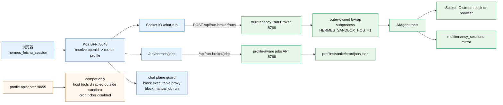

# hermes-web-ui 架构速查 — EKKO fork

> [!info] 这是哪一个 web-ui？
> **EKKO 系 `hermes-web-ui`**：`https://github.com/EKKOLearnAI/hermes-web-ui`，Koa 2 + Vue 3 + Naive UI + Pinia 全家桶。本机 fork 不在 nesquena 那条 Python+vanilla-JS 单体老版本上。
> ⚠️ 别把它跟同名笔记里的 `hermes-webui (nesquena)` 混了——那是另一条嵌入式单体 Python 实现，对比详见 [[对比 — hermes-webui (nesquena) vs hermes-web-ui (EKKO) 架构 2026-05-06]]。
> 当前本机开发入口是 `/Users/kite/code/hermes-web-ui`；生产入口是 `root@10.250.1.66` 的 `hermes-web-ui.service`，监听 `0.0.0.0:8648`。不要用旧 launchd PID 判断生产状态。

> [!warning] 2026-05-14 Cron 投递语义
> WebUI 创建定时任务时，主流场景是投递到飞书，而不是投递到本地 WebUI。生产默认用户身份是 `sunke` UAT profile；job 写入 `profiles/sunke/cron/jobs.json`，由 `hermes-gateway.service` 的 multitenancy cron worker 执行并通过 Feishu adapter 投递给 owner open_id。投递成功后 multitenancy 会 mirror 到 `multitenancy_sessions`，这样用户基于飞书推送继续对话时有上下文。
>
> 已有 job 的执行/飞书投递不依赖 `hermes-gateway@sunke.service` 常驻；WebUI 创建/管理任务也已走 `hermes-multitenancy` Run Broker sidecar 的 `/api/run-broker/jobs`。生产 canary 在 `hermes-gateway@sunke.service` 停止期间通过 WebUI BFF 创建、列表、删除 job `0dbd12ced3b1` 成功。

> [!warning] 2026-05-14 chat-plane 执行边界
> `3090768` 后，chat plane 不再允许通用 proxy 把 `POST /v1/responses`、`POST /v1/chat/completions`、`POST /v1/runs` 透传到 profile apiserver，也不允许 `/api/hermes/jobs/:id/run` 手动执行 cron。保留的 WebUI 能力是任务创建/管理、只读 response 查询、profile-scoped 文件/记忆等管理面。正常浏览器聊天的 Socket.IO `chat-run-socket.ts` 已新增 WebUI Run Broker client seam：`HERMES_WEBUI_RUN_BROKER=1` 且 `HERMES_RUN_BROKER_URL` 设置时，会构造 `RunRequest(channel="webui", profile_name, user_key, content, session_id, delivery_mode="socket", requires_host_tools=true)` 并 POST 到 `${HERMES_RUN_BROKER_URL}/api/run-broker/runs`，再把 broker 的 `content/done/error/tool_*` 事件映射回 Socket.IO。如果配置了 `HERMES_RUN_BROKER_KEY`，WebUI 会发送 `Authorization: Bearer <key>`，对应 multitenancy 侧 `HERMES_MULTITENANCY_RUN_BROKER_KEY`。生产 66 已开启该路径，Socket.IO canary 通过 terminal 输出 `SANDBOX=1`，说明浏览器 chat-run 已经进入 router-owned bwrap 执行面。

> [!info] 2026-05-15 WebUI Feishu UAT ensure
> WebUI 的飞书 OAuth 登录仍只负责 `open_id -> profile` 身份绑定，不把 OAuth access token 当工具 UAT 使用，也不把 UAT 存入 cookie/localStorage/WebUI DB。OAuth 登录成功后直接进入 WebUI；UAT 是登录后的侧栏连接状态，不再是进入 `/hermes/chat` 的门禁。左下角飞书连接按钮会调用受保护 BFF 接口 `GET /api/auth/feishu/uat/status`；若 multitenancy credential vault 中当前 `profile + open_id` 缺少有效 UAT 或 scope 不足，按钮显示红点。点击红点会调用 `POST /api/auth/feishu/uat/start`，打开等价于 `/feishu_auth` 的 device-flow 授权链接，并轮询 `/api/auth/feishu/uat/sessions/:sessionId`；授权成功后红点变绿点。
>
> BFF 代理这些请求时只信任服务端解析出的 `ctx.state.user.profile/openid`，忽略浏览器 body/query 里伪造的 `profile_name/open_id/user_key`；请求再通过 `${HERMES_RUN_BROKER_URL}` 和可选 `HERMES_RUN_BROKER_KEY` 进入 multitenancy Run Broker sidecar。因此 WebUI 与 multitenancy 必须同发。完成授权后，UAT 由 multitenancy 写入 `multitenancy_credentials` 与 profile-local `feishu_uat/<open_id>.json` 兼容位置；WebUI 只看到 `missing/expired/scope_missing/valid` 等 redacted 状态。
>
> 生产修正：`1c76058` 显式在 chat plane 放行 `/api/auth/feishu/uat/*`。这些接口仍位于 `authProtectedRoutes` 之后，必须先有 WebUI session；放行只避免 `/api/auth/*` 管理面 denylist 误挡用户自助授权。`91f376a` 把 UAT 授权从 LoginView 移到 AppSidebar：登录页不再展示“授权飞书工具”，也不再用前端路由守卫按 UAT 状态拦截受保护页面。`920c866` 断开授权新窗口的 `window.opener` 后再跳转飞书 device-flow URL，避免外部授权页保留 opener 引用。

---

## §1 TL;DR — 60 秒看懂

### §1.1 当前 WebUI 目标态



现在 WebUI 的关键边界：
- 浏览器聊天走 `HERMES_WEBUI_RUN_BROKER=1`，不是 profile apiserver `/v1/responses`。
- 定时任务创建/管理走 `HERMES_WEBUI_JOBS_BROKER`（默认跟随 run broker），不是 profile apiserver `/api/jobs`。
- 飞书 OAuth 登录完成后，WebUI 还要确保同一个 `profile + open_id` 有有效 Feishu UAT；缺失时走 Run Broker sidecar 的 device-flow 授权会话，效果等价于在飞书里使用 `/feishu_auth`。
- profile apiserver 仍可保留给兼容/管理，但 chat plane 的 executable proxy 和手动 job run 是 fail-closed。

### §1.2 历史 BFF 结构图

```
   浏览器 (Vue 3 SPA hash router)
        │  HTTP + cookie hermes_feishu_session
        ▼
┌────────────────────────────────────────┐
│  Koa 2 BFF  :8648                       │
│  ── public  /api/auth/feishu/{login,    │
│             callback,logout}            │
│  ── auth mw requireAuth → enforcePlane  │
│  ── protected /api/hermes/* (BFF)       │
│             sessions / profiles / files │
│             skills / memory / jobs / …  │
│  ── catch-all proxy → hermes gateway    │
│                                          │
│  GatewayManager:                         │
│    profile → 127.0.0.1:<port>            │
│    sunke              → :8655            │
│    multitenancy_router cron worker       │
│      executes profile cron and delivers  │
│      to Feishu owner_open_id             │
└──────────┬───────────────────────────────┘
           │ fetch (native) +
           │ Authorization: Bearer <API_SERVER_KEY 来自 profile/.env>
           ▼
   Hermes API Server (per profile, in ~/.hermes/profiles/<name>/)
        ↑   ↑   ↑
        │   │   └─ feishu UAT 链路 (~/code/hermes-feishu-uat → feishu_g41a5b5g)
        │   └─── multitenancy.db (open_id → user_id → profile_name)
        └─ ~/code/hermes-multitenancy 共享同张路由表
```

**关键事实链**：
- **Web UI 是 BFF + profile 集群的反向代理**——不是 nesquena 的 in-process embedding；hermes 在另一个进程里跑（[[ARCHITECTURE-GUIDE]] 主图的 web-ui 那一块）。
- **飞书 OAuth → multitenancy.db → profile** 已经 100% 落地（`controllers/auth.ts:146` callback + `services/feishu-oauth.ts:230 exchangeFeishuCode` + `services/request-context.ts:81 resolveProfileForOpenId`）。
- **当前生产 canonical profile 是 `sunke`**，WebUI detect/register 已存在 gateway，`sunke` API/runtime gateway 当前端口是 `8655`。
- **Cron 投递主路径是 Feishu owner_open_id**：WebUI 负责创建/管理任务；执行、Feishu 投递、上下文 mirror 由 multitenancy router worker 承担。
- **当前没有 X-Hermes-Open-Id / X-Hermes-User 注入到上游**——profile 已经在 BFF 层选好了，hermes 端是 profile-bound 的"哑"进程。

---

## §2 仓库结构 + 关键模块

```
hermes-web-ui/                       (单 package，不是 workspaces)
├── bin/hermes-web-ui.mjs            CLI entry
├── packages/
│   ├── server/src/                  Koa 2 BFF（TypeScript strict）
│   │   ├── index.ts                 bootstrap：cors→bodyParser→routes→proxy→static
│   │   ├── config.ts                env 解析（plane / authMode / feishu / multitenancy / …）
│   │   ├── controllers/             业务处理（thin route → fat controller）
│   │   │   ├── auth.ts              密码/飞书登录 callback
│   │   │   └── hermes/*             hermes 业务控制器（19 个文件）
│   │   ├── routes/                  纯映射 URL → controller
│   │   │   ├── index.ts             public → auth → protected → proxy 注册顺序（**核心**）
│   │   │   ├── auth.ts              /api/auth/{status,login,feishu/*,logout,…}
│   │   │   └── hermes/              26 个子路由 + proxy catch-all
│   │   ├── services/
│   │   │   ├── auth.ts              requireAuth 中间件（authMode 三分支）
│   │   │   ├── feishu-oauth.ts      OAuth dance + cookie HMAC 签验
│   │   │   ├── request-context.ts   resolveProfileForOpenId / WebUser / enforcePlaneAccess
│   │   │   └── hermes/
│   │   │       ├── gateway-manager.ts        多 profile 网关生命周期（关键 SSRF 闸）
│   │   │       ├── chat-run-socket.ts        Socket.IO /chat-run namespace（~60 kB）
│   │   │       ├── session-sync.ts           启动时把 hermes profile sessions 同步进 web-ui SQLite
│   │   │       └── hermes-cli.ts             child_process.execFile('hermes', …) 调本地 CLI
│   │   ├── db/hermes/               自建 SQLite（~/.hermes-web-ui/web-ui.db）
│   │   └── lib/                     共用 utility
│   └── client/src/                  Vue 3 SPA（Naive UI + Pinia + vue-router hash）
│       ├── App.vue / main.ts        bootstrap
│       ├── router/index.ts          hash router + hiddenInChatPlane 守卫
│       ├── api/                     fetch 封装
│       │   ├── client.ts            request<T>() + X-Hermes-Profile 注入逻辑
│       │   └── hermes/*             21 个 API 模块（chat/jobs/profiles/…）
│       ├── stores/hermes/           Pinia setup-store（chat ~63 kB）
│       ├── components/hermes/       业务组件
│       ├── views/                   LoginView + 17 个 hermes/* 页面
│       ├── i18n/locales/            en / zh / de / es / fr / ja / ko / pt
│       └── styles/                  variables.scss + 主题
├── dist/                            esbuild + Vite 产物
├── scripts/build-server.mjs         esbuild bundle server
├── package.json                     v0.5.16
└── CLAUDE.md                        开发约定（路由 / 控制器 / i18n 模板）
```

> [!note] CLAUDE.md vs 本文
> `CLAUDE.md` 讲"如何写新代码"（命名、模板、TS 风格、放在哪个目录）。本文讲"现在的代码长什么样、为什么这样、谁连谁、坑在哪"。两者互补，**实现新功能先看 CLAUDE.md**，**排障/对账先看本文 + 06 调研笔记**。

---

### §2.1 Server 子目录展开

| 目录 | 文件数 | 用途 | 备注 |
|---|---|---|---|
| `controllers/` | 1 (auth) + `hermes/` 18 | thin route 委派的真实业务逻辑 | health/upload/webhook 单独在根；hermes/* 全在子目录 |
| `controllers/hermes/sessions.ts` | 25 kB | web-ui 自建会话 CRUD | **最大 controller**，含 session_sync + 分页 + 多 profile 过滤 |
| `controllers/hermes/models.ts` | 17 kB | 模型列表 + provider 解析 | chat plane 下剥 api_key / base_url |
| `controllers/hermes/codex-auth.ts` | 12 kB | Codex device OAuth flow | caller key 用 `feishu:${user.openid}` 隔离 |
| `controllers/hermes/profiles.ts` | 12 kB | profile CRUD（用户模式 403） | |
| `controllers/hermes/kanban.ts` | 11 kB | 看板视图 | |
| `controllers/hermes/copilot-auth.ts` | 9 kB | Copilot device flow | |
| `controllers/hermes/config.ts` | 9 kB | 配置读写（chat plane 限制段） | |
| `controllers/hermes/nous-auth.ts` | 9 kB | NousResearch device flow | |
| `controllers/hermes/providers.ts` | 9 kB | provider 管理（用户模式 403） | |
| `controllers/hermes/cron-history.ts` | 9 kB | Cron 历史 | |
| `controllers/hermes/skills.ts` | 12 kB | skills 列表（chat plane 写 403） | |
| `routes/` | 6 shared + `hermes/` 24 | 纯 URL → controller 映射 | 注册顺序见 §4.1 |
| `routes/hermes/files.ts` | 10 kB | profile workspace 文件浏览 | 强制根目录到 `profiles/<p>/workspace` |
| `routes/hermes/proxy-handler.ts` | 10 kB | **核心**：上游 fetch + SSE + 用量拦截 | |
| `routes/hermes/terminal.ts` | 16 kB | WebSocket PTY (node-pty) | 默认 `HERMES_TERMINAL_ENABLED=0` 关 |
| `routes/hermes/group-chat.ts` | 8 kB | socket.io 多 agent 群聊 | in-memory adapter |
| `routes/hermes/download.ts` | 5 kB | 下载路径限制 | |
| `services/hermes/` | 17 | hermes 业务服务 | |
| `services/hermes/chat-run-socket.ts` | **60 kB** | socket.io /chat-run namespace | **最大文件**，对话状态机 |
| `services/hermes/gateway-manager.ts` | 34 kB | profile gateway 生命周期 + SSRF 闸 | |
| `services/hermes/file-provider.ts` | 34 kB | 文件 backend 抽象（profile / docker / ssh / terminal） | |
| `services/hermes/hermes-cli.ts` | 21 kB | child_process.execFile 包装 | |
| `services/hermes/conversations.ts` | 16 kB | 对话流处理 | |
| `services/hermes/model-context.ts` | 13 kB | 模型上下文管理 | |
| `services/hermes/plugins.ts` | 10 kB | 插件管理 | |
| `services/hermes/copilot-models.ts` | 11 kB | Copilot 模型列表 | |
| `services/hermes/hermes-kanban.ts` | 11 kB | 看板服务 | |
| `services/feishu-oauth.ts` | 10 kB | OAuth dance + cookie 签验 | |
| `services/request-context.ts` | 6 kB | WebUser + profile lookup + plane access | |
| `services/auth.ts` | 4 kB | requireAuth 中间件 | |
| `services/login-limiter.ts` | 8 kB | 暴力登录限流 | |
| `db/hermes/` | 8 文件 | SQLite schema + store | 自建 `~/.hermes-web-ui/web-ui.db` |

### §2.2 Client 子目录展开

| 目录 | 重点文件 | 大小 | 备注 |
|---|---|---|---|
| `stores/hermes/chat.ts` | chat store | **63 kB** | **最大前端文件**，Pinia setup-store；含 session list / message / streaming / queue / wake event |
| `stores/hermes/kanban.ts` | kanban store | 10 kB | |
| `stores/hermes/group-chat.ts` | group chat store | 13 kB | |
| `stores/hermes/files.ts` | files store | 8 kB | |
| `stores/hermes/profiles.ts` | profiles store | 7 kB | active profile name 在这里 |
| `stores/hermes/{app,gateways,jobs,models,settings,usage,session-browser-prefs}.ts` | 其余 9 个 store | <5 kB | |
| `views/hermes/TerminalView.vue` | terminal 页 | 31 kB | xterm + WebSocket |
| `views/hermes/HistoryView.vue` | 历史会话 | 28 kB | |
| `views/hermes/KanbanView.vue` | 看板视图 | 12 kB | |
| `views/hermes/PluginsView.vue` | 插件视图 | 12 kB | |
| `views/hermes/MemoryView.vue` | 记忆视图 | 12 kB | 用户模式隐藏 SOUL |
| `views/hermes/SkillsView.vue` | 技能视图 | 11 kB | 用户模式只读 |
| `views/hermes/FilesView.vue` | 文件视图 | 7 kB | profile workspace 沙箱 |
| `views/LoginView.vue` | 登录页 | 8 kB | 飞书 / 密码 / token 三入口 |
| `api/hermes/chat.ts` | chat 客户端 | 15 kB | SSE + socket.io 双通道 |
| `api/hermes/kanban.ts` | kanban 客户端 | 7 kB | |
| `api/hermes/sessions.ts` | sessions 客户端 | 7 kB | |
| `api/hermes/jobs.ts` | jobs 客户端 | 6 kB | |
| `api/hermes/group-chat.ts` | group chat 客户端 | 6 kB | |
| `api/client.ts` | 共享 fetch wrapper | 5 kB | `request<T>()` + `getAuthMode()` + profile header 注入 |
| `i18n/locales/` | en, zh, de, es, fr, ja, ko, pt | 8 个 locale | flat nested object，按 feature 分段 |
| `composables/useKeyboard.ts` / `useTheme.ts` | 共享 composable | | |

### §2.3 用户模式可见 / 隐藏路由表

锚点：`packages/client/src/router/index.ts:14-100` + `router/index.ts:125 beforeEach`

| 路由 | name | `meta.hiddenInChatPlane` | 用户模式可见 |
|---|---|---|---|
| `/hermes/chat` | `hermes.chat` | ❌ | ✅ |
| `/hermes/history` | `hermes.history` | ❌ | ✅ |
| `/hermes/jobs` | `hermes.jobs` | ❌ | ✅ |
| `/hermes/kanban` | `hermes.kanban` | ❌ | ✅ |
| `/hermes/models` | `hermes.models` | ✅ | ❌ |
| `/hermes/profiles` | `hermes.profiles` | ✅ | ❌ |
| `/hermes/logs` | `hermes.logs` | ✅ | ❌ |
| `/hermes/usage` | `hermes.usage` | ❌ | ✅ |
| `/hermes/skills` | `hermes.skills` | ❌ | ✅ (只读) |
| `/hermes/plugins` | `hermes.plugins` | ❌ | ✅ |
| `/hermes/memory` | `hermes.memory` | ❌ | ✅ (隐藏 SOUL) |
| `/hermes/settings` | `hermes.settings` | ❌ | ✅ (只显示安全段) |
| `/hermes/gateways` | `hermes.gateways` | ✅ | ❌ |
| `/hermes/channels` | `hermes.channels` | ✅ | ❌ |
| `/hermes/terminal` | `hermes.terminal` | ✅ | ❌ |
| `/hermes/group-chat` | `hermes.groupChat` | ❌ | ⚠️ 占位（后端 403） |
| `/hermes/files` | `hermes.files` | ❌ | ✅ (profile workspace 沙箱) |

> [!warning] 服务端 ACL 才是真锁
> `hiddenInChatPlane` 只是前端隐藏入口。**真正的鉴权在 `enforcePlaneAccess`**（`services/request-context.ts:170`）。前端如果绕过隐藏直接访问 `/hermes/profiles`，后端 API 仍然 403——前后端双闸。

---

## §3 运行时拓扑

> [!warning] 这一节描述的是"打开 launchd 守护、跑 dist 构建"的本机生产链路；如果你在跑 `npm run dev`（nodemon + Vite），端口和 env 会变（见末尾 §运行模式分叉）。

### §3.1 进程 / 端口

| 项 | 值 | 来源锚点 |
|---|---|---|
| 进程 PID | `56768` | `launchctl list \| grep ekko` |
| 守护服务 | `com.hermes.ekko-webui` (launchd) | `/Users/kite/Library/LaunchAgents/com.hermes.ekko-webui.plist` |
| 监听 | `0.0.0.0:8648` | `index.ts:62` + `lsof -i :8648` |
| 构建产物 | `/Users/kite/code/hermes-web-ui/dist/server/index.js` | plist `ProgramArguments` |
| Node | `/opt/homebrew/bin/node` (≥23) | plist + `package.json` engines |
| stdout | `~/.hermes/ekko-web-ui/webui.out.log` | plist `StandardOutPath` |
| stderr | `~/.hermes/ekko-web-ui/webui.err.log` | plist `StandardErrorPath` |
| pino log | `~/.hermes-web-ui/logs/server.log` | `index.ts:194` |
| 工作目录 | `/Users/kite/code/hermes-web-ui` | plist `WorkingDirectory` |

### §3.2 关键环境变量（plist 实测）

```
HERMES_AUTH_MODE                = feishu-oauth-dev        ← 进入飞书 OAuth 分支
HERMES_WEB_PLANE                = chat                    ← 用户模式，运维 API 全 403
HERMES_CHAT_PLANE_ALLOW_SETTINGS = 1                       ← 允许 /api/hermes/config GET/PUT 安全段
HERMES_HOME                     = /Users/kite/.hermes
HERMES_BIN                      = /Users/kite/.local/bin/hermes
HERMES_MULTITENANCY_DB          = /Users/kite/.hermes/multitenancy.db
GATEWAY_AUTOSTART               = none                    ← BFF 不自动起 gateway，按需 wake
PROFILE                         = coder                   ← 默认 activeProfile（[待 verify] 与 multitenancy.db active 行不一致：见 §8.4）
SESSION_STORE                   = local
PORT                            = 8648
FEISHU_APP_ID                   = cli_***REDACTED***      ← app id 不进公开仓库，生产实值只看服务器 env/vault
FEISHU_APP_SECRET               = ***REDACTED***
FEISHU_SESSION_SECRET           = ***REDACTED***
FEISHU_REDIRECT_URI             = http://localhost:8648/api/auth/feishu/callback
AUTH_DISABLED                   = 1                       ← 冗余：feishu-oauth-dev 先 return（auth.ts:59-66）
NODE_ENV                        = production
UPSTREAM                        = http://127.0.0.1:8643   ← **代码不读这个 env**（见 §4.1），装饰品
```

### §3.3 启动 / 重启 / 健康检查

```bash
# 启动（plist 已是 RunAtLoad + KeepAlive）
launchctl load -w ~/Library/LaunchAgents/com.hermes.ekko-webui.plist

# 重启
launchctl kickstart -k gui/$UID/com.hermes.ekko-webui

# 直接退出（launchd 会自动重启）
kill $(pgrep -f 'dist/server/index.js')

# 健康检查
curl -s http://127.0.0.1:8648/health | jq .
```

`/health` 由 `controllers/health.ts` 处理，**会 fork `hermes --version`** 但有 60s 缓存（计划文档 2026-05-07 修过：每次请求不再堆积子进程）。

---

## §4 上游 hermes API server 调用

> [!success] 这一节是排障人最关心的：浏览器 chat 请求最终怎么落到 hermes 的？
> **简短回答**：catch-all proxy 在 `routes/hermes/proxy.ts` + `proxy-handler.ts:203 proxy()`，profile 通过 `getRequestProfile(ctx)` → `GatewayManager.getUpstream(profile)` 决定 upstream URL；headers 由 `buildProxyHeaders()` 集中构造，注入 `Authorization: Bearer <API_SERVER_KEY>`，**不**注入 X-Hermes-Open-Id。

### §4.1 路由顺序（绝对重要）

锚点：`packages/server/src/routes/index.ts:40-78`

```
public 路由（无 auth）：
  healthRoutes        /health
  webhookRoutes       /webhook
  authPublicRoutes    /api/auth/status, /api/auth/login, /api/auth/feishu/*, /api/auth/logout
  ttsRoutes           TTS（必须在 auth 前）

middlware:
  requireAuth         services/auth.ts:57（三分支：trusted-feishu / feishu-oauth-dev / token）
  enforcePlaneAccess  services/request-context.ts:170（chat plane 黑名单）

protected 路由（按注册顺序）：
  authProtectedRoutes  /api/auth/{me,setup,change-*,locked-ips,…}
  uploadRoutes         /api/upload
  updateRoutes         /api/hermes/update
  sessionRoutes        /api/hermes/sessions/*      ← 本地 SQLite BFF
  profileRoutes        /api/hermes/profiles/*
  skillRoutes          /api/hermes/skills/*
  pluginRoutes
  memoryRoutes
  modelRoutes          /api/hermes/available-models, …
  providerRoutes
  configRoutes
  logRoutes
  codexAuthRoutes      /api/hermes/codex-auth/*   ← OAuth device flow，BFF 自己跑
  nousAuthRoutes
  copilotAuthRoutes
  gatewayRoutes
  weixinRoutes
  groupChatRoutes
  fileRoutes           /api/hermes/files/*
  downloadRoutes       /api/hermes/download
  jobRoutes            /api/hermes/jobs/*
  cronHistoryRoutes
  kanbanRoutes
  proxyRoutes          proxyRoutes.all('/api/hermes/{*any}', proxy)

mount:
  app.use(proxyMiddleware)   ← catch-all，兜底 /api/hermes/* 和 /v1/* 未匹配到的路径

SPA fallback:
  koa-static dist/client + send index.html
```

> [!danger] 不要乱插路由
> 新增 `/api/hermes/<x>` 路由必须**在 proxyRoutes 之前**注册，否则被 catch-all 吞掉直接打 hermes gateway。详见 `CLAUDE.md` "Important: Custom API endpoints handled locally"。

### §4.2 proxy 单点：唯一的 fetch 调用

锚点：`packages/server/src/routes/hermes/proxy-handler.ts:203 proxy()`

```ts
proxy-handler.ts:204    const profile = resolveProfile(ctx)                       // getRequestProfile(ctx)
proxy-handler.ts:207    upstream = resolveUpstream(ctx)                           // GatewayManager.getUpstream(profile)
proxy-handler.ts:213    const upstreamPath = ctx.path
                          .replace(/^\/api\/hermes\/v1/, '/v1')
                          .replace(/^\/api\/hermes/, '/api')
proxy-handler.ts:217    const url = `${upstream}${upstreamPath}${search ? `?${search}` : ''}`
proxy-handler.ts:219    const headers = buildProxyHeaders(ctx, upstream)
proxy-handler.ts:225-226  isSSE = SSE_EVENTS_PATH.test(upstreamPath)              // /v1/runs/:id/events
                          timeoutMs = isSSE ? 30 * 60 * 1000 : 120 * 1000
proxy-handler.ts:259      res = await fetch(url, requestInit)
proxy-handler.ts:300      if (sseMatch) await streamSSE(ctx, res, profile)        // 拦 run.completed 写用量
```

**还有第二处 fetch**：`services/hermes/chat-run-socket.ts` 给 Socket.IO `/chat-run` namespace 发送流式请求。生产 66 已启用 `HERMES_WEBUI_RUN_BROKER=1`，会跳过 `GatewayManager.getUpstream(profile)`，改为向 `${HERMES_RUN_BROKER_URL}/api/run-broker/runs` 提交 `RunRequest(channel="webui")`，并在 `HERMES_RUN_BROKER_KEY` 存在时带 Bearer shared secret。未启用 broker flag 的开发/回滚环境仍保留默认 profile apiserver 兼容路径，但 chat plane 的生产主路径是 broker。

### §4.3 profile 决定 upstream URL

锚点：`services/request-context.ts:121-125`

```ts
export function getRequestProfile(ctx: Context): string {
  const user = ctx.state?.user as WebUser | undefined
  if (config.webPlane === 'chat' && user?.profile) return user.profile     // ← chat plane 强制 user.profile
  return (ctx.get?.('x-hermes-profile') || (ctx.query?.profile as string) || getActiveProfileName() || 'default')
}
```

> [!warning] chat plane 下 profile 不能被前端覆盖
> `HERMES_WEB_PLANE=chat` 时，`user.profile`（cookie 里飞书 OAuth 绑的那个）**强制生效**。`X-Hermes-Profile` header、`?profile=` query 都失效。
> 这是飞书账号 ↔ profile 绑定的强约束，绕不过去。如果要在浏览器调试别的 profile，要么改 plist `HERMES_WEB_PLANE=both` 重启，要么换登的飞书账号。

锚点：`services/hermes/gateway-manager.ts:505-511`

```ts
getUpstream(profileName?: string): string {
  const name = profileName || this.activeProfile
  const gw = this.gateways.get(name)
  if (gw?.url) return gw.url                                // 内存里已注册的 gateway
  const { port, host } = this.readProfilePort(name)         // 读 ~/.hermes/profiles/<name>/config.yaml
  return buildHttpUrl(host, port)                           // → http://127.0.0.1:<port>
}
```

每个 profile 自己一个端口，写在 `~/.hermes/profiles/<name>/config.yaml` 的 `platforms.api_server.extra.port`。`coder=8643`、`feishu_g41a5b5g/feishu_ee966643` 各自的端口由 `GatewayManager.resolvePort()` 检测冲突后写入。

### §4.4 SSRF 闸（必看，否则配置可被弱化为攻击面）

锚点：`services/hermes/gateway-manager.ts:65-95 + isAllowedUpstreamHost()`

```ts
const DEFAULT_UPSTREAM_HOSTS = new Set(['127.0.0.1', '::1', 'localhost'])
// 通过 HERMES_UPSTREAM_HOSTS 扩展（CSV，exact-match hostnames）
```

`proxy-handler.ts:77` 二次校验：`new URL(raw).hostname` 必须在 allowlist 内，否则 503。**defence-in-depth**——profile 的 `config.yaml` 是用户可写文件，如果不闸 `host` 字段，BFF 可被滥用成 generic SSRF。

### §4.5 buildProxyHeaders：当前没有 user identity 注入

锚点：`proxy-handler.ts:84-108`

| Header | 值 | 行为 |
|---|---|---|
| `host` | upstream host（重写） | line 89-90 |
| `origin` / `referer` / `connection` / `authorization` | **剥掉** | line 91-92 |
| `cookie` | **原样透传** | 默认 fall-through（[待 verify] 这是 leak：浏览器 `hermes_feishu_session=…` 会到 hermes，详见 06 §9-5）|
| `authorization` | `Bearer <API_SERVER_KEY>`（从 `~/.hermes/profiles/<profile>/.env` 读 `API_SERVER_KEY=…`） | `gateway-manager.ts:514 getApiKey()` |
| `X-Hermes-Open-Id` / `X-Hermes-User-Id` / `X-Hermes-Union-Id` | **没注入** | profile-per-gateway 模型不需要 |
| `X-Hermes-Profile` | 客户端 fetch 会带（chat plane 下被服务端忽略） | `client.ts:94` + `request-context.ts:124` |

> [!note] 如果要切换成"单 hermes 多租户" 架构
> 改动 surface < 10 行：在 `proxy-handler.ts:99-104 buildProxyHeaders()` 末尾插入：
> ```ts
> const user = (ctx.state as any).user as WebUser | undefined
> if (user?.openid) headers['x-hermes-open-id'] = user.openid
> ```
> hermes-multitenancy 端的 `lookup_by_open_id` / `lookup_by_union_id` / `lookup_by_user_id` 已就绪（[[hermes-multitenancy ARCHITECTURE-GUIDE]] router.py 章节）。
> ⚠️ 但要先决定**单 hermes 进程是否够吃飞书 bot + web ui 两条入口**，目前是每条入口一个 profile-bound 进程。

---

## §5 用户身份模型（飞书三件套）

### §5.1 飞书 OAuth 拿到的字段

锚点：`services/feishu-oauth.ts:44-75` + `:230-269 exchangeFeishuCode()`

| ID | 长度/形态 | OAuth 直接返回？ | 跨 app | 跨 tenant |
|---|---|---|---|---|
| `open_id` | `ou_<32 hex>` | ✅ `/authen/v1/access_token` 直接给 | 每 app 不同 | 唯一 |
| `union_id` | `on_<32 hex>` | ❌ 要单独 `/contact/v3/users/<open_id>` | 同主体下一致 | 唯一 |
| `user_id` | 企业自定义 8-12 字符 | ❌ 同上 | 同 tenant 内一致 | 不跨 tenant |

**web-ui OAuth 当前只拿了 `open_id`**——access_token / refresh_token 立即丢，user_id / union_id 完全没抓。

### §5.2 WebUser 形态（每个 ctx 都有）

锚点：`services/request-context.ts:10-16`

```ts
interface WebUser {
  openid: string         // 飞书 open_id
  profile: string        // 已绑定的 hermes profile name（来自 multitenancy.db）
  role: 'user' | 'admin'
  name?: string          // 飞书姓名
  avatarUrl?: string
}
```

落地路径：cookie payload (`feishu-oauth.ts:116-128 createFeishuSessionCookie`) → 浏览器 HttpOnly cookie → 每次请求 `parseFeishuSessionCookie()` → `ctx.state.user`。

### §5.3 multitenancy.db lookup（**单路径**）

锚点：`services/request-context.ts:81-100 resolveProfileForOpenId()`

```sql
SELECT profile_name FROM multitenancy_routing
WHERE open_id = ? AND active = 1 LIMIT 1
```

**只 by `open_id`**——不 fallback 到 `union_id` / `user_id`。如果 web-ui 用的飞书 app 跟 hermes-multitenancy 写入 db 时用的 app 不同（→ 不同 open_id），lookup miss → callback 直接 403 `No Hermes profile is bound to this Feishu user`。

实测 db 当前 active 行（已脱敏；公开 ID 保留）：

```
user_id   | open_id                              | profile_name      | active
----------|--------------------------------------|-------------------|--------
ee966643  | ou_63348b2d4c8f885768bdc6c7d7fc26ee | feishu_ee966643   | 1
g41a5b5g  | ou_cf23e7c262afa4b7a006baa75f863ed5 | feishu_g41a5b5g   | 1
```

> [!info] profile 命名规则
> 飞书 bot 链路（multitenancy 写入）：`feishu_<user_id>`。Unknown user 兜底：`feishu_<open_id>`。两种命名都合法（hermes-multitenancy README:249 + router.py:1311 都接受 `startswith("feishu_")`）。web-ui 端不需要造 profile_name——直接读 db 里的 `profile_name` 字段。

### §5.4 candidate db 路径（多 fallback）

`request-context.ts:71-79 candidateMultitenancyDbs()`：

```
1. config.multitenancyDb (env HERMES_MULTITENANCY_DB) → ~/.hermes/multitenancy.db
2. ~/.hermes/multitenancy.db                          ← 默认主表
3. ~/.hermes/multitenancy_routing.db                  ← legacy fallback
```

每个都试，第一个查到的赢。读用 `node:sqlite DatabaseSync({readOnly: true})`——**不锁不写**，安全跟 hermes-multitenancy / feishu-uat 并行读。

### §5.5 三种 authMode 分支（services/auth.ts:57 requireAuth）

| mode | 触发 | 入参 | 实现 |
|---|---|---|---|
| `feishu-oauth-dev` | 当前 plist 用的 | `Cookie: hermes_feishu_session=<base64.HMAC>` | `feishu-oauth.ts:271 feishuOAuthAuth` |
| `trusted-feishu` | 反代场景（飞书前置代理签 header） | `X-Feishu-OpenID` + `X-Hermes-Auth-Timestamp` + `X-Hermes-Auth-Signature` | `request-context.ts:102 trustedFeishuAuth` |
| `token` | 默认密码 / Bearer | `Authorization: Bearer <token>` 或 `?token=` 或 `hermes_session` cookie | `services/auth.ts:73-119` |

⚠️ plist 同时设 `HERMES_AUTH_MODE=feishu-oauth-dev` + `AUTH_DISABLED=1`：飞书分支先 return，`AUTH_DISABLED` 不生效（详见 06 §3.3）。

---

## §6 用户模式改造现状 — 2026-05-07 编年史

> 详见 [[计划 - Hermes Web UI 用户模式改造 2026-05-06]]（~89 kB 全本）。本节摘 7 个 milestone：

### Milestone 1 — 飞书 OAuth 整链路接通（2026-05-06 之前）
- `feishu-oauth.ts` + `controllers/auth.ts:124-194` 完成 login → callback → bound session 全流程。
- 用户绑定示例：`ou_cf23e7… → feishu_g41a5b5g`。
- callback 把 `name / avatarUrl` 落 cookie；access_token / refresh_token 立即丢。

### Milestone 2 — 用户模式 UI 收口（2026-05-06）
- AppSidebar 显示飞书身份卡（姓名 / openid 摘要 / 锁定 profile）。
- 隐藏运维入口：频道、模型管理、日志、网关、用户/Profile 管理。
- SettingsView 用户模式只保留：显示、代理、记忆、会话、隐私。
- 工具调用从纯文本升级为带状态的卡片，识别 `/sandbox/...` 标 `profile sandbox`。

### Milestone 3 — Chat Plane 服务端 ACL（2026-05-07 前半）
- `request-context.ts:135 forbiddenInChatPlane()` 落黑名单：
  - 403：`/api/hermes/profiles`, `/api/hermes/gateways`, `/api/hermes/config/credentials`, `/api/hermes/group-chat`, `/api/hermes/cron-history`, `/api/hermes/logs`, `/api/hermes/update`, `/api/hermes/channels`。
  - 白名单允许：`/api/hermes/sessions`, `/search/sessions`, `/usage/stats`, `/jobs`, `/files`, `/skills`(GET only), `/memory`(GET/POST only), `/download`, `/v1/*`, `/available-models`。
  - `HERMES_CHAT_PLANE_TEMP_OPEN_ADMIN` 已废弃。
- `GET /api/hermes/config` 只返回安全段：`display / agent / memory / session_reset / privacy / approvals`，不返回 platforms / credentials。

### Milestone 4 — 会话级 model/provider（2026-05-07 中段）
- 用户模式不允许写 `/api/hermes/config/model`（403）。
- 模型选择从"写 profile 默认配置"改成"会话级 session state"。
- `StartRunRequest` 加 `provider?: string` 字段，与 model 一起透传到 `/v1/responses` body。
- 配套修了 `gateway/platforms/api_server.py`：`_create_agent` 接受 `model_override / provider_override`（hermes-agent 端 patch）。

### Milestone 5 — Files 沙箱（2026-05-07 后半）
- 开放 `/api/hermes/files/*`，路由层强制把根目录限定到 `~/.hermes/profiles/<profile>/workspace`。
- 不再使用 active/root profile、terminal/docker/ssh backend。
- DELETE 接口走 query 参数（生产 Koa bodyParser 不解 DELETE body）。
- 2026-05-15 安全补充：profile runtime 为兼容通用 skills 可能把 token 物化到 `workspace/credentials/` 或 `workspace/tokens/`，但这不是用户可见文件。WebUI 文件 API 在服务端 fail-closed：根列表过滤 `.env`、`auth.json`、`config.yaml`、`feishu_uat/`、`credentials/`、`tokens/`、`.ssh/`；直接 list/read/stat/write/delete/rename/copy/upload/download 这些路径一律 403。不要只靠前端隐藏。
- 2026-05-15 追加补强：Skills 文件浏览接口也改成 `relative()` 边界判断，不能用 `startsWith()`；`skills-secret/` 这类同前缀兄弟目录不能被 `/api/hermes/skills/{*path}` 读到，同时复用敏感路径 denylist，避免 skill 文件面成为 token 文件旁路。

### Milestone 6 — Wake on login + Health 缓存（2026-05-07）
- 飞书 OAuth user 加载成功后，AppSidebar `onMounted` 自动 `POST /api/hermes/jobs/wake` 唤醒对应 profile 的 hermes runtime。
- `controllers/health.ts` 加 60s 缓存：并发 `/health` 不再堆 `hermes --version` 子进程。

### Milestone 7 — Terminal / Download 边界（2026-05-07）
- 用户模式聊天抽屉隐藏 Terminal tab，路由 `meta.hiddenInChatPlane` 守卫（`router/index.ts:125`）。
- `/api/hermes/download` 相对路径只解析到 profile workspace；绝对路径只允许 upload 目录。

---

## §7 与 multitenancy / feishu-uat / lark-bridge 的关系

```
   飞书 Bot 通路                    Web UI 通路
   ────────────                    ───────────
   飞书消息 → lark-bridge WS         浏览器 → :8648 web-ui BFF
            ↓                                  ↓
   hermes-feishu-uat               飞书 OAuth callback
   (~/code/hermes-feishu-uat)             ↓
   ↳ feishu_g41a5b5g profile        multitenancy.db lookup
   ↳ feishu_ee966643 profile        (resolveProfileForOpenId)
            ↓                                  ↓
   hermes-multitenancy plugin         GatewayManager
   (~/code/hermes-multitenancy)              ↓
   写入 multitenancy.db               getUpstream(profile)
   open_id ↔ user_id ↔ profile               ↓
            ↑                          fetch http://127.0.0.1:<port>
            └──── 共享 ───────────────────────┘
```

> [!info] web-ui 是飞书 bot 的**侧链路**，不是必经之路
> 飞书 IM 消息只走 lark-bridge → hermes-feishu-uat → hermes 这条主链；web-ui 是给同一个用户的"浏览器仪表盘 + 网页对话"另开一条 BFF。**两条链路共用同一张 `multitenancy.db` 路由表**——这就是"一个飞书账号在 IM 里和在 web-ui 里看到的是同一个 profile 的同一份会话"的根本原因。

详见兄弟文档：
- [[hermes-multitenancy ARCHITECTURE-GUIDE]]：multitenancy.db schema、router.py 三路 lookup、profile 命名规则的权威来源。
- [[hermes-feishu-uat ARCHITECTURE-GUIDE]]：UAT 主仓的 feishu app 注册、IM event 路由、profile-bound gateway 的 `gateway/platforms/api_server.py`。
- [[ARCHITECTURE-GUIDE]]：Obsidian 总图，三仓 + lark-bridge 在一张拓扑图上的关系。

---

## §8 已知 bug + 技术债 + 风险

### §8.1 `Cookie` 透传到 hermes gateway（potential leak）
- `buildProxyHeaders()` 没 strip `Cookie`，浏览器的 `hermes_feishu_session=<HMAC>` 一路 forward 到 hermes:port。
- 目前 hermes 端忽略它，但**万一以后 hermes 加 cookie 中间件就会冲突**。
- 建议：strip cookie or 只送 minimal subset。锚点：`proxy-handler.ts:93-95`。

### §8.2 OAuth lookup 单路径
- `resolveProfileForOpenId` 只 SELECT by `open_id`，不 fallback `union_id` / `user_id`。
- 风险：web-ui 跑的飞书 app ≠ multitenancy.db 写入时用的飞书 app → open_id 不一致 → callback 直接 403。
- Fix 候选 A：cookie 里多存 user_id / union_id，OAuth callback 多调一次 `/contact/v3/users/<open_id>?user_id_type=user_id`。
- Fix 候选 B：lookup 改成三段 fallback。锚点：`request-context.ts:81`。

### §8.3 `UPSTREAM` env 装饰品
- plist `UPSTREAM=http://127.0.0.1:8643` **代码不读这个 env**——`GatewayManager.getUpstream()` 直接从 profile config.yaml 读端口。
- 建议在 plist 里去掉，避免误导。

### §8.4 `PROFILE=coder` vs multitenancy active 不一致
- plist `PROFILE=coder`，但 multitenancy.db 当前 `coder|active=0`（已 inactive）。
- 当 `webPlane=chat` + 用户 cookie 有 user.profile 时，`PROFILE` env 实际没用（user.profile 强制覆盖）。
- 但 BFF 启动时 `session deleter started, profile=coder`（`index.ts:177-179`）仍按 env 起，可能给后续 session 清理逻辑造成偏差。锚点：`index.ts:177`。

### §8.5 socket.io chat-run 的 cookie 解析
- `services/hermes/chat-run-socket.ts:288` 解的是同一份 cookie，独立写一份 cookie 解析逻辑（不走 Koa cookie parser）。
- 改 `getFeishuSessionSecret` 时**记得同步 chat-run / group-chat / terminal** 三处都吃同一个 secret，但是各自从 raw cookie header 抽取。
- 锚点：`feishu-oauth.ts:14 extractFeishuSessionFromCookieHeader`（共享 helper，已收口）。

### §8.6 Vite chunk size 警告（既有，不阻塞）
- `npm run build` 会报某些 chunk > 1000 kB（monaco / mermaid）。计划文档每次验证都写"仍只有既有 Vite 大 chunk 警告"——确认非新增。

### §8.7 SOCKET.IO in-memory adapter
- group-chat / chat-run 都用 socket.io 4.8 默认 in-memory adapter。
- 单实例 OK；多实例水平扩展要 `socket.io-redis-adapter`。详见 [[对比 — hermes-webui (nesquena) vs hermes-web-ui (EKKO) 架构 2026-05-06]] §3.3。

### §8.8 `hermes-cli` 启动延迟
- 多个 controller 通过 `child_process.execFile('hermes', […])` 跑 CLI 子进程：listSessions / listProfiles / gateway start。
- 启动延迟 + maxBuffer 50 MB——如果 hermes binary 路径变了或 binary 卡住，整条 BFF 调用会等到 timeout。
- 锚点：`services/hermes/hermes-cli.ts`。

---

## §9 后续 TODO（从计划文档 + 06 调研）

- [ ] **Agent 唤醒可见性**：`正在唤醒 / 强制启动 / 重试 / 休眠` 需要 gateway 暴露真实状态，前端不能假装可用。
- [ ] **profile sandbox ↔ runtime sandbox** 映射：当前 Web Files 看的是 `profiles/<profile>/workspace`，runtime container 的真实沙箱是另一个路径，需要双向同步或只读映射。
- [ ] **Feishu channel parity**：飞书承接正式流量，web 侧和飞书侧的 profile runtime / 工具权限 / 记忆注入要一致。
- [ ] **用量页用户视角**：拆 token / 会话 / 工具 / 任务用量；不再暴露 provider 成本 / key。
- [ ] **技能页只读 + MCP**：用户模式后端写入已 403，前端再隐藏 enable/disable / pin/unpin UI。
- [ ] **真实飞书 OAuth 全链路扫码**：本机 Chrome 没有可复用飞书登录态，需要一次真实扫码验证 callback 入库。
- [ ] **lookup 三段 fallback**：参见 §8.2。
- [ ] **Cookie strip**：参见 §8.1。
- [ ] **UPSTREAM / PROFILE plist 清理**：参见 §8.3 + §8.4。

---

## §10 排障 FAQ（按现象索引）

### Q1 浏览器点"飞书登录"，跳到飞书授权页后 callback 直接 403 `No Hermes profile is bound to this Feishu user`

可能根因（按概率排序）：
1. **multitenancy.db 里没有 active 行**：`sqlite3 ~/.hermes/multitenancy.db "SELECT * FROM multitenancy_routing WHERE active=1"`——空了就先去 hermes-multitenancy 端补绑。
2. **web-ui 飞书 app ≠ multitenancy 写入时用的飞书 app**：两个 app 的 `cli_*` ID 不一样 → 同一个员工 open_id 不一样 → lookup miss。看 plist `FEISHU_APP_ID` 跟 hermes-multitenancy 端配的 app_id 是否一致。
3. **db 文件路径不对**：env `HERMES_MULTITENANCY_DB` 指错地方；候选路径见 §5.4。
4. **HMAC 验证失败前置 401**：先看 `~/.hermes/ekko-web-ui/webui.err.log` 是否有 `Invalid Feishu OAuth state`——那是 state cookie + state query mismatch（多半因为浏览器 cookie 被清/换浏览器）。

### Q2 chat 页发消息后 502 `Upstream gateway unreachable`

- 看日志 stderr，多半是 `ECONNREFUSED` 到 `127.0.0.1:<port>`。
- 排查链：
  1. `getRequestProfile(ctx)` 返回什么 profile？看 cookie `hermes_feishu_session` 解出 user.profile。
  2. `~/.hermes/profiles/<profile>/config.yaml` 的 `platforms.api_server.extra.port` 是几？
  3. `lsof -i :<port>` 看 hermes gateway 是否在跑。
  4. 没在跑 → wake：`curl -X POST -b "<cookie>" http://localhost:8648/api/hermes/jobs/wake`。
  5. 跑了但还是 502 → SSRF allowlist 命中：`HERMES_UPSTREAM_HOSTS` 没加非 loopback host？

### Q3 SSE chat 流卡 60 秒后断开

- `proxy-handler.ts:226 timeoutMs = isSSE ? 30 * 60 * 1000 : 120 * 1000`——SSE 是 30 分钟。60 秒断开**不是 timeout**，多半是浏览器侧或反向代理（nginx？）的 idle timeout。
- 也可能是 client disconnect 传播：`clientAbort.abort()` 被触发（`proxy-handler.ts:232 onClientClose`）。

### Q4 用户模式下 `X-Hermes-Profile` header 设了但没生效

- 这是设计。`getRequestProfile()` 在 `webPlane === 'chat'` 下强制 `user.profile`，header 被忽略。详 §4.3。
- 要切其它 profile：换登的飞书账号，或临时设 `HERMES_WEB_PLANE=both` + 重启。

### Q5 `npm run dev` 启动报 `hermes: command not found`

- `services/hermes/hermes-cli.ts` 内部 `execFile('hermes', …)`。CLAUDE.md "Prerequisite: hermes CLI must be installed and on $PATH"。
- Fix：`ln -s /Users/kite/.local/bin/hermes /usr/local/bin/hermes` 或 export PATH。

### Q6 `/health` 返回 `gateway: stopped` 但其实 gateway 在跑

- 检查 `~/.hermes/profiles/<profile>/gateway.pid` 是否 stale。
- `GatewayManager.detectStatus()`（`gateway-manager.ts:573`）流程：读 pid → 活否 → health check → 失败用 `lsof` 找实际端口 → 不一致就 update config.yaml。
- 如果 health check 持续失败但进程在跑，多半 hermes 内部死锁——直接 kill pid 让 launchd/supervisor 重启。

### Q7 想看 BFF 跟 hermes 之间发的 raw 请求

- `pino` 日志在 `~/.hermes-web-ui/logs/server.log`，但默认 level 不会打 body。
- 临时调试：`pino` 在 `services/logger.ts` 配置；env `LOG_LEVEL=debug` + 重启。
- 更直接：在 `proxy-handler.ts:259 fetch` 前后插 `logger.debug({url, headers}, 'proxy fetch')`。

### Q8 socket.io 群聊跨实例不工作

- 已知限制（详 §8.7）：默认 in-memory adapter，单实例 only。
- 多实例需要换 `socket.io-redis-adapter`，没现成代码。

### Q9 `npm run build` 通过但 dist/server 跑起来报 ESM/CJS 错

- `scripts/build-server.mjs` 用 esbuild bundle 成单文件。如果新加的依赖**只发 ESM**，可能要在 esbuild config 加 `format: 'esm'` 或 explicit external。
- 检查 `package.json` engines `node >= 23`——别用 18/20 跑 dist。

### Q10 看不懂 `chat-run-socket.ts` 60 kB

- 入口：`init()` → `setupNamespace()` → `handleRun()` (line ~600+)。
- 核心三状态：`sessionMap`（per-session run state） / `getOrCreateSession` / `markCompleted`。
- 默认上游 fetch 是 `${upstream}/v1/responses`（不是 `/v1/runs`）——chat-run 走 OpenAI Responses API 兼容路径。
- `HERMES_WEBUI_RUN_BROKER=1` 时改走 `${HERMES_RUN_BROKER_URL}/api/run-broker/runs`，WebUI 只作为 channel adapter 提交 `RunRequest(channel="webui")`，并把 broker stream 映射为现有 `message.delta` / `run.completed` / `run.failed` / tool events；`HERMES_RUN_BROKER_KEY` 用于给 multitenancy sidecar 加 Bearer 边界。生产 66 已启用，当前 sidecar 是 `http://127.0.0.1:8766`。
- 跟 catch-all proxy `/v1/runs` 是**两条独立通道**（一个 socket.io 流式 / 一个 SSE）。

---

## 运行模式分叉（dev vs prod）

| 维度 | `npm run dev` | launchd 守护（当前生产） |
|---|---|---|
| 入口 | `nodemon + ts-node packages/server/src/index.ts` | `node dist/server/index.js` |
| 前端 | Vite dev server 8648（proxy `/api`, `/v1`, `/health`, `/upload`, `/webhook` 到后端） | dist/client 静态文件由 Koa serve |
| 端口 | 8648（同上，由 vite + koa 共用） | 8648 |
| 热更新 | server nodemon + client HMR | 无 |
| 启动命令 | `npm run dev` | `launchctl kickstart -k gui/$UID/com.hermes.ekko-webui` |

CLAUDE.md 写过：dev 模式下"`hermes` CLI 必须在 `$PATH`"——确实，server 内部多处 `execFile('hermes', …)`。

---

## 附录 A：关键文件锚点速查表

> 排障时直接 vim `file:line` 跳过去。

| 主题 | 文件 | 行 | 备注 |
|---|---|---|---|
| Bootstrap | `packages/server/src/index.ts` | 79 | `async function bootstrap()` |
| Config 全表 | `packages/server/src/config.ts` | 39-71 | 所有 env 来源 |
| 路由注册顺序 | `packages/server/src/routes/index.ts` | 40-78 | public → auth → protected → proxy |
| 飞书 OAuth login | `packages/server/src/controllers/auth.ts` | 124 | `feishuLogin` |
| 飞书 OAuth callback | `packages/server/src/controllers/auth.ts` | 146 | `feishuCallback` |
| OAuth code → token | `packages/server/src/services/feishu-oauth.ts` | 230 | `exchangeFeishuCode` |
| OAuth cookie 签 | `packages/server/src/services/feishu-oauth.ts` | 116 | `createFeishuSessionCookie` |
| OAuth cookie 验 | `packages/server/src/services/feishu-oauth.ts` | 130 | `parseFeishuSessionCookie` |
| Cookie HMAC secret | `packages/server/src/services/feishu-oauth.ts` | 112 | `getFeishuSessionSecret` |
| WebUser 形态 | `packages/server/src/services/request-context.ts` | 10-16 | `interface WebUser` |
| OAuth profile lookup | `packages/server/src/services/request-context.ts` | 81-100 | `resolveProfileForOpenId` |
| getRequestProfile | `packages/server/src/services/request-context.ts` | 121-125 | chat plane 强用 user.profile |
| enforcePlaneAccess | `packages/server/src/services/request-context.ts` | 170 | chat plane 黑名单 |
| forbiddenInChatPlane | `packages/server/src/services/request-context.ts` | 135-168 | chat plane 白/黑名单详细规则 |
| Auth 中间件三分支 | `packages/server/src/services/auth.ts` | 57-119 | `requireAuth` |
| feishuOAuthAuth | `packages/server/src/services/feishu-oauth.ts` | 271 | 每请求解 cookie |
| trustedFeishuAuth | `packages/server/src/services/request-context.ts` | 102 | 反代头模式 |
| Proxy 核心 | `packages/server/src/routes/hermes/proxy-handler.ts` | 203 | `proxy(ctx)` |
| buildProxyHeaders | `packages/server/src/routes/hermes/proxy-handler.ts` | 84-108 | 头集中处 |
| 唯一 fetch 调用 | `packages/server/src/routes/hermes/proxy-handler.ts` | 259 | HTTP/SSE 共用 |
| SSE 拦截 / 用量 | `packages/server/src/routes/hermes/proxy-handler.ts` | 162 | `streamSSE` |
| SSRF 闸 | `packages/server/src/services/hermes/gateway-manager.ts` | 87 | `isAllowedUpstreamHost` |
| getUpstream | `packages/server/src/services/hermes/gateway-manager.ts` | 505-511 | profile → URL |
| getApiKey | `packages/server/src/services/hermes/gateway-manager.ts` | 514 | profile/.env API_SERVER_KEY |
| chat-run socket fetch | `packages/server/src/services/hermes/chat-run-socket.ts` | handleRun | 默认 `${upstream}/v1/responses`；flag path `${HERMES_RUN_BROKER_URL}/api/run-broker/runs` |
| socket.io cookie 鉴权 | `packages/server/src/services/hermes/chat-run-socket.ts` | 288 | feishu cookie 复用 |
| Terminal WS 鉴权 | `packages/server/src/routes/hermes/terminal.ts` | 78-86 | feishu cookie 复用 |
| sessions schema | `packages/server/src/db/hermes/schemas.ts` | 29-55 | `SESSIONS_SCHEMA` |
| set/get run-session map | `packages/server/src/routes/hermes/proxy-handler.ts` | 14-22 | run_id → session_id |
| Client fetch wrapper | `packages/client/src/api/client.ts` | ~80 | `request<T>()` |
| Client profile header | `packages/client/src/api/client.ts` | 92-95 | `X-Hermes-Profile` 注入条件 |
| Router | `packages/client/src/router/index.ts` | 1-100 | hash history + hiddenInChatPlane |
| User mode 路由守卫 | `packages/client/src/router/index.ts` | 125 | `if (isUserMode() && to.meta.hiddenInChatPlane)` |
| AppSidebar 用户模式 | `packages/client/src/components/layout/AppSidebar.vue` | 75 + 343 | `.sidebar.user-mode` |
| LoginView 飞书登录 | `packages/client/src/views/LoginView.vue` | 35-71 | `handleFeishuLogin` |

---

## 附录 B：环境变量速查表

| 变量 | 默认 | 用途 | 锚点 |
|---|---|---|---|
| `PORT` | `8648` | BFF 监听端口 | `config.ts:40` |
| `BIND_HOST` | `0.0.0.0` | 绑定 host | `config.ts:7-10` |
| `UPLOAD_DIR` | `~/.hermes-web-ui/upload` | 文件上传根 | `config.ts:43` |
| `CORS_ORIGINS` | `''`（same-origin only） | `'*'` 或 CSV 白名单 | `config.ts:50` + `index.ts:114` |
| `SESSION_STORE` | `local` | `local` (BFF SQLite) / `remote` (hermes CLI) | `config.ts:52` |
| `HERMES_WEB_PLANE` | `both` | `chat` (用户模式) / `ops` / `both` | `config.ts:53` |
| `HERMES_AUTH_MODE` | `token` | `token` / `trusted-feishu` / `feishu-oauth-dev` | `config.ts:54` |
| `HERMES_TRUSTED_HEADER_OPENID` | `X-Feishu-OpenID` | trusted 模式 openid header 名 | `config.ts:55` |
| `HERMES_TRUSTED_HEADER_TIMESTAMP` | `X-Hermes-Auth-Timestamp` | trusted 模式时间戳 header 名 | `config.ts:56` |
| `HERMES_TRUSTED_HEADER_SIG` | `X-Hermes-Auth-Signature` | trusted 模式 HMAC header 名 | `config.ts:57` |
| `HERMES_TRUSTED_HEADER_SECRET` | `''` | trusted 模式 HMAC secret | `config.ts:58` |
| `HERMES_TRUSTED_HEADER_MAX_AGE_SECONDS` | `300` | trusted timestamp 允许偏差 | `config.ts:59` |
| `HERMES_MULTITENANCY_DB` | `~/.hermes/multitenancy.db` | 路由表位置 | `config.ts:60` |
| `FEISHU_APP_ID` | `''` | 飞书 app_id | `config.ts:61` |
| `FEISHU_APP_SECRET` | `''` ***REDACTED 必填*** | 飞书 app_secret | `config.ts:62` |
| `FEISHU_REDIRECT_URI` | `''` | OAuth callback URL | `config.ts:63` |
| `FEISHU_AUTHORIZE_URL` | `https://open.feishu.cn/open-apis/authen/v1/index` | oversea 部署换 `open.larksuite.com` | `config.ts:64` |
| `FEISHU_API_BASE_URL` | `https://open.feishu.cn` | 同上 | `config.ts:65` |
| `FEISHU_SESSION_SECRET` | `''` ***REDACTED*** | cookie HMAC secret，fallback 到 trustedHeader / appSecret | `config.ts:66` + `feishu-oauth.ts:112` |
| `FEISHU_SESSION_MAX_AGE_SECONDS` | `604800` (7天) | cookie 过期 | `config.ts:67` |
| `FEISHU_CALLBACK_REDIRECT` | `/#/` | callback 跳转默认页 | `config.ts:68` |
| `HERMES_CHAT_PLANE_ALLOW_SETTINGS` | `false` | 允许 chat plane `GET/PUT /api/hermes/config` 安全段 | `config.ts:69` |
| `HERMES_CHAT_PLANE_TEMP_OPEN_ADMIN` | `false` | 历史临时开 admin（已废弃） | `config.ts:70` |
| `AUTH_TOKEN` | unset | 强制覆盖随机 token（token mode） | `services/auth.ts:38` |
| `AUTH_DISABLED` | `false` | 关 token 校验（飞书 mode 下冗余） | `config.ts:36` |
| `HERMES_HOME` | `~/.hermes` | hermes profile 根 | `gateway-manager.ts:58` |
| `HERMES_BIN` | `hermes` | hermes CLI 路径 | `gateway-manager.ts:60` |
| `PROFILE` | `default` | activeProfile（chat plane 下基本被覆盖） | `gateway-bootstrap.ts:18` |
| `GATEWAY_AUTOSTART` | `none` | `all` / `active` / `none` 启动时是否自动起 gateway | bootstrap 流程 |
| `HERMES_UPSTREAM_HOSTS` | `127.0.0.1,::1,localhost` | SSRF allowlist 扩展（CSV） | `gateway-manager.ts:74-83` |
| `HERMES_TERMINAL_ENABLED` | `0` | 是否启 PTY WebSocket | `routes/hermes/terminal.ts` |
| `UPSTREAM` | unset | **不读，装饰品**（plist 写过但代码 grep 不到） | — |
| `HERMES_WEBUI_RUN_BROKER` | `0` | WebUI Socket.IO chat-run 是否提交到 Run Broker | `chat-run-socket.ts` |
| `HERMES_RUN_BROKER_URL` | unset | multitenancy Run Broker sidecar base URL，例如 `http://127.0.0.1:8766` | `chat-run-socket.ts` |
| `HERMES_RUN_BROKER_KEY` | unset | WebUI → multitenancy Run Broker Bearer shared secret | `chat-run-socket.ts` |

---

## Changelog

- 2026-05-15：新增 WebUI Feishu UAT ensure：受保护 BFF 接口 `/api/auth/feishu/uat/{status,start,sessions/:id}` 通过服务器端 session 身份代理到 multitenancy Run Broker sidecar；UAT 作为左侧栏飞书连接状态展示，红点表示未连接，绿点表示已有 UAT，点击红点启动 device-flow 授权；LoginView 只负责飞书 OAuth 登录并直接进入 WebUI，不接触原始 UAT token。`1c76058` 追加修复 chat-plane access control，允许这些已登录用户自助授权接口通过，不开放其他 `/api/auth/*` 管理面；`91f376a` 移除 LoginView/路由守卫 UAT 门禁并把授权入口移到 AppSidebar；`920c866` 在打开飞书授权 URL 前清空新窗口 `opener`。
- 2026-05-14：新增 WebUI Run Broker client seam：`HERMES_WEBUI_RUN_BROKER=1` 时 `chat-run-socket.ts` 构造 `RunRequest(channel="webui")` 并提交到 `${HERMES_RUN_BROKER_URL}/api/run-broker/runs`；支持 `HERMES_RUN_BROKER_KEY` Bearer shared secret。生产 `hermes-web-ui@dc2f2ab` 已开启该路径，Socket.IO terminal canary 返回 `SANDBOX=1`。
- 2026-05-14：新增 WebUI jobs broker seam：`hermes-web-ui@700ae53` 后，chat plane 下 `/api/hermes/jobs` 默认跟随 `HERMES_WEBUI_RUN_BROKER` 走 `${HERMES_RUN_BROKER_URL}/api/run-broker/jobs`；`HERMES_WEBUI_JOBS_BROKER` 可单独覆盖。生产 canary 在 profile apiserver 停止期间创建并删除 job 成功。
- 2026-05-11：初稿。基于 06-webui-internals.md (v3) + 计划文档 30+ 子条目 + 实测仓库锚点（PID 56768、v0.5.16）。
