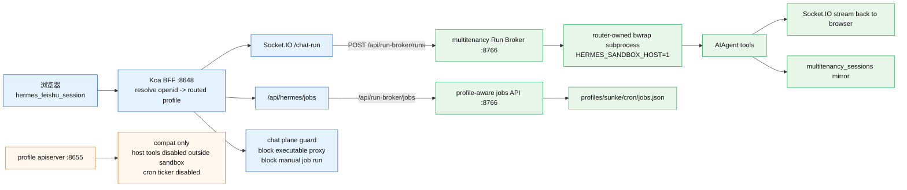

# hermes-web-ui 架构速查 — EKKO fork

> [!info] 这是哪一个 web-ui？
> **EKKO 系 `hermes-web-ui`**：`https://github.com/EKKOLearnAI/hermes-web-ui`，Koa 2 + Vue 3 + Naive UI + Pinia 全家桶。本机 fork 不在 nesquena 那条 Python+vanilla-JS 单体老版本上。
> ⚠️ 别把它跟同名笔记里的 `hermes-webui (nesquena)` 混了——那是另一条嵌入式单体 Python 实现，对比详见 [[对比 — hermes-webui (nesquena) vs hermes-web-ui (EKKO) 架构 2026-05-06]]。
> 当前本机开发入口是 `/Users/kite/code/hermes-web-ui`；生产入口是 `root@10.250.1.66` 的 `hermes-web-ui.service`，监听 `0.0.0.0:8648`。不要用旧 launchd PID 判断生产状态。

> [!success] 2026-05-25 已发布 — PR #25 upstream 0.6 baseline 本地等价版
> 运行代码 `main@ef0d033473d8` 已发布到生产 `10.250.1.66`；生产仓库 HEAD 可能包含后续 docs-only commit。本轮把 2026-05-24/25 的 upstream 0.6 baseline worktree 合入 PR #25，同时保持本 fork 的 Feishu OAuth/open_id 身份源、multitenancy owner/profile ACL、Run Broker 执行路径和 Credentials/UAT 边界。生产发布先配套发布 `hermes-multitenancy@ed6e4b4620ce`，再 WebUI `git pull --ff-only`、`pnpm install --frozen-lockfile`、`pnpm run build`、重启 `hermes-web-ui.service`；备份目录 `/home/hermes/backups/webui-multitenancy-upstream060-20260525-121617`。
>
> 线上验证：`8648/health` OK，公网 `https://hermes.gotokeep.com/` 200；签名 `sunke` Feishu session 访问 `/api/auth/me` 返回 200 且包含 upstream-compatible `{ user }` 包装，`/api/hermes/profiles` 返回 5 个 owner-visible profiles（2 group、1 user、2 webui agent），没有全局 profile 泄漏。本机发布门禁：`bun run test` 为 127 files / 820 passed / 2 skipped，`pnpm run build` passed；生产 build 只有既有大 chunk warning。下面 worktree 段落保留为决策历史，其中“未发布生产”已被本段取代。

> [!success] 2026-05-25 已发布 — kep-cli OAuth callback 生产回跳修复
> `main@8310b15` 已发布到生产 `10.250.1.66`，修复 Credentials 页 kep-cli 认证 URL 把 `response_url=http://localhost:<port>` 暴露给远端浏览器的问题。WebUI 现在对 `kep-auth login` 返回的授权 URL 创建短期 callback session，把 `response_url` 改写为当前外部 origin 的 `/api/auth/kep-cli/callback/:sessionId`；Keep 回跳后 BFF 只转发到该 session 捕获的生产同机 `localhost/127.0.0.1` kep-auth listener，token exchange 和 profile-local 保存继续由 kep-auth 负责。不开放通用 localhost proxy，不改变 Lark-cli、Keep-record 或 GitLab 凭证流程。
>
> 发布备份：`/home/hermes/backups/hermes-webui-kep-cli-oauth-callback-20260525-123450`。本机门禁：RED/GREEN `tests/server/skill-credentials.test.ts`，server `tsc`，focused auth/credentials/client tests 39 passed；全量 `pnpm run test` 为 127 files / 821 passed / 2 skipped，`pnpm run build` passed。生产 build passed 并重启 `hermes-web-ui.service`；`8648/health` OK，公网 `/health` 200。生产签名 `sunke` session 启动 kep-cli auth 返回 `response_origin=https://hermes.gotokeep.com` 且 callback path 为 `/api/auth/kep-cli/callback/...`，未知 callback session 返回 404。

> [!info] 2026-05-24 worktree — upstream 0.6 baseline request-profile adapter
> `webui-upstream-060-baseline` 第一批只接 upstream-compatible 的 request-profile 形状，不切执行路径。新增 `packages/server/src/middleware/user-auth.ts`，在既有 `requireAuth` 与 `enforcePlaneAccess` 之后把 Feishu/multitenancy `request-context` 解析出的 profile 写入 `ctx.state.profile = { name }`，并把现有 `ctx.state.user.openid/profile` 补成 upstream 风格的 `id/username/profiles` 字段。`routes/index.ts` 注册该 middleware 后，后续 upstream controller 可读取 `ctx.state.profile`，但身份来源仍是 Feishu OAuth/open_id，profile ACL 仍由 `getRequestProfile()` / `ownerOwnsProfile()` 决定。明确未吸收 upstream 删除 `feishu-oauth.ts` / `request-context.ts`，也未启用 `agent-bridge`、未改 Run Broker、Credentials/UAT、group chat、cron/jobs/kanban 或生产发布路径。
>
> 23:26 追加：同一 worktree 内 `/api/auth/me` 现在同时保留 Hermes 既有 Feishu 顶层字段，并增加 upstream 0.6 风格 `{ user: { id, username, role, status, profiles, ... } }` 包装；客户端 `fetchCurrentUser()` 会优先解包 `res.user`，旧格式仍兼容。这里的 `user.id/username/profiles` 来自已验证 Feishu session/open_id 与 `middleware/user-auth.ts` adapter，不引入 upstream password/JWT 作为生产身份源。验证：`tests/server/feishu-oauth.test.ts`、`tests/client/api.test.ts`、auth/profile focused 9 files / 103 tests、server `tsc`、client `vue-tsc` 均通过；仍未合入或发布生产。
>
> 23:29 追加 guard：`tests/server/auth.test.ts` 明确锁住 Feishu OAuth 模式下 `getToken()` 返回 `null`，且 `requireAuth()` 不接受 Bearer/password token 作为用户身份。后续吸收 upstream password/JWT/users-store 时，这条测试必须继续保证生产 owner/open_id 只能来自 Feishu session 或 trusted header adapter。
>
> 23:32 追加 run-chat 低风险贴合：新增 upstream 风格 `packages/server/src/services/hermes/run-chat/response-utils.ts`，把 `responseFunctionCallToToolCall`、`summarizeToolArguments`、`extractResponseText` 从 `chat-run-socket.ts` 内联函数提取为模块并复用。该变更是纯数据转换 helper，不启用 upstream `agent-bridge`，也不改变 `HERMES_WEBUI_RUN_BROKER` 生产执行路径。验证：`tests/server/run-chat-response-utils.test.ts`、`chat-run-socket`、`run-chat-broker`、`chat-run-message-flush` focused 4 files / 34 tests 通过，server `tsc` 通过。
>
> 23:34 追加 run-chat SSE 工具贴合：`run-chat/sse-utils.ts` 导出 `parseSseFrame()`，`chat-run-socket.ts` 复用该模块的 `readSseFrames()`，移除 socket 内重复 SSE parser。验证：`tests/server/run-chat-sse-utils.test.ts`、`chat-run-socket`、`run-chat-broker`、`chat-run-message-flush` focused 4 files / 33 tests 通过，server `tsc` 通过。
>
> 23:50 追加 profile UI 低风险端口：新增 upstream `ProfileAvatar.vue` 和 `ProfileAvatar` API 类型，并在 `ProfileCard.vue` 标题处显示 generated/image avatar。只吸收展示组件，不吸收 upstream 的 profile switching 语义变化，因此 chat-plane 本地 owner profile 选择行为不变。验证：`tests/client/profile-avatar.test.ts`、profiles focused 4 files / 18 tests 通过，client `vue-tsc` 通过。
>
> 23:56 追加 profile avatar 闭环：新增 `PUT/DELETE /api/hermes/profiles/:name/avatar`，头像元数据存储在 WebUI 本地 `profile-metadata` 目录；chat-plane 下写操作只允许当前 Feishu user 绑定 profile 或 `ownerOwnsProfile(openid, name)` 的 profile。客户端新增 `updateProfileAvatar/deleteProfileAvatar` 与 Pinia `updateAvatar/deleteAvatar`，会同步 profiles、detail cache、active profile。验证：`tests/server/profiles-routes.test.ts`、`tests/client/profile-avatar.test.ts`、`tests/client/profiles-store.test.ts` focused 3 files / 33 tests 通过，server `tsc` 和 client `vue-tsc` 通过。
>
> 2026-05-25 00:02 追加 ProfileSelector 头像入口：在现有 upstream `ProfileSelector` 轻量形态上增加 active profile 头像显示和“自定义头像”弹窗，支持随机 generated avatar 与重置，并复用 owner-scoped `profilesStore.updateAvatar/deleteAvatar`。没有吸收 upstream runtime restart/gateway 控制面，也没有改变本地 profile switch 语义。验证：`tests/client/profile-selector.test.ts` 先红后绿；头像/store/i18n focused 4 files / 25 tests 通过，client `vue-tsc` 通过。
>
> 2026-05-25 00:09 追加聊天内文本文件预览：吸收 upstream `bf74745` 的低风险 UX，`MarkdownRenderer.vue` 对聊天消息中的本地 `.md/.txt/.json/.csv/...` 文件卡片点击打开右侧预览抽屉，下载图标仍保持下载语义；读取仍走既有 `/api/hermes/download` BFF，因此 token/query 下载的已知边界没有扩大，也不改变后端 file scope。验证：新增 preview/download icon 回归；`tests/client/markdown-rendering.test.ts`、`tests/client/api.test.ts`、`tests/client/i18n-coverage.test.ts` 为 3 files / 52 tests 通过，client `vue-tsc` 通过。
>
> 2026-05-25 00:14 追加 profile-scoped view 初始化：吸收 upstream `f4c70bd` 的核心行为，新增 `ensureProfileSelection()`，Files/Jobs/Memory/Skills/Usage/Channels/Models/Plugins/Settings 等 profile-scoped 页面在发自身请求前先确保 profile store 已有 active profile/list，避免首个请求缺 `X-Hermes-Profile` 而落到默认 profile。该 helper 只调用现有 `profilesStore.fetchProfiles()`，不改变 profile switch 或 owner ACL。验证：Jobs/Files 先红后绿覆盖调用顺序；相关视图 focused 6 files / 19 tests 通过，client `vue-tsc` 通过。
>
> 2026-05-25 00:17 追加 profile list parser：吸收 upstream `ab7dd00` 的长列解析修复，新增 `profile-list-parser.ts`，`listProfiles()` 以磁盘 profile 目录和 `active_profile` 为事实源，`hermes profile list` 输出只补 gateway/alias runtime 信息；长 profile 名或长 model 把表格列撑满时不再错切 profile/model/gateway。CLI 失败时降级返回磁盘 profile 列表，不直接 500。验证：`tests/server/profile-list-parser.test.ts`、`tests/server/profiles-routes.test.ts` 为 2 files / 17 tests 通过，server `tsc` 通过。
>
> 2026-05-25 00:25 追加 bundled skills 同步：吸收 upstream `f90e79f`、`20f51f4`、`8d261c3`、`3e8f84a` 的最小闭环，新增 `HermesSkillInjector`，启动时把 `packages/skills` 中的 HyperFrames、Remotion、Markdown Viewer 同步到 default 和每个 named profile，profile 新建/切换时也补同步目标 profile。同步只覆盖 WebUI bundled skill 同名目录，不删除 profile-local 其他技能；build 会把 `packages/skills` 复制到 `dist/skills`。验证：新增 RED/GREEN `tests/server/skill-injector.test.ts`，与 `tests/server/profiles-routes.test.ts` focused 2 files / 17 tests 通过。
>
> 2026-05-25 00:31 追加 profile-aware session deep links：吸收 upstream `df41d6b` 的核心薄片，新增 `/hermes/session/:sessionId`、`/hermes/history/session/:sessionId`、`/hermes/group-chat/room/:roomId` 路由；session API 可带 `profile` query；ChatView/HistoryView 会按 URL 中 session/profile 加载对应会话，chat-run socket resume/run 也使用 session profile，避免跨 profile 链接落到当前浏览器 active profile。未吸收 upstream e2e/playwright 套件和完整 group room 路由同步逻辑。验证：RED/GREEN `router-user-mode`、`chat-store-user-mode`、`api`、`chat-view-startup`、`history-view-user-mode` focused 5 files / 43 tests 通过。
>
> 2026-05-25 00:38 追加 subagent 事件工具卡：吸收 upstream `634a622` 的低风险前端薄片，`chat-run` socket 透传 `subagent.start/tool/progress/complete`，chat store 把同一 subagent run 折叠成 `delegate_task` tool card 并在 complete 时写入摘要结果。该变更只改善 Run Broker/API Server 已转发事件的前端展示，不启用 upstream `agent-bridge`、不改变 delegate_task 执行路径、owner/profile ACL 或生产发布路径。验证：RED/GREEN `tests/client/chat-store-user-mode.test.ts -t "renders subagent run events"`，focused 36 tests 通过，`pnpm run test` 为 120 files / 787 passed / 2 skipped，`pnpm run build` 通过。
>
> 2026-05-25 00:44 追加登录锁阈值与恢复提示：吸收 upstream `61b4151`，将同 IP password/token 失败锁定阈值从 3 次调到 10 次，并在 WebUI 登录页遇到 429/503 时显示 `hermes-web-ui clear-login-locks --restart` 与 `hermes-web-ui reset-default-login` 恢复命令。该改动只影响 token/password fallback 登录的限流与提示，不改变生产 Feishu OAuth/open_id 身份源，也不放宽 chat-plane owner/profile ACL。验证：RED/GREEN `tests/server/login-limiter.test.ts` 与 `tests/client/login-view.test.ts -t "recovery commands"`；focused `login-limiter/login-view/i18n-coverage/auth` 4 files / 30 tests 通过；`pnpm run test` 为 121 files / 790 passed / 2 skipped，`pnpm run build` 通过。
>
> 2026-05-25 01:12 追加 external skill sources：吸收 upstream `4176923` 的受限版本，`skills.external_dirs` 可配置额外 skill 根目录；WebUI 技能页把这些 skill 标记为 `external`，本地同名 skill 优先，外部目录只在已配置且存在的目录内扫描/读取。`listFiles`/`readFile` 会先解析本地 skill，再解析配置的 external skill，并继续做 skillDir 内路径校验与 sensitive path 检查；未配置目录不会进入 BFF 读取面。验证：RED/GREEN `tests/server/skills-controller.test.ts` 与 `tests/client/skill-list.test.ts`；focused `skills-controller/skill-list/i18n-coverage/skills-user-mode` 4 files / 10 tests 通过，client/server `tsc` 通过；最终 `pnpm run test` 为 122 files / 792 passed / 2 skipped，`pnpm run build` passed。
>
> 2026-05-25 01:23 追加 native navigation：吸收 upstream `acdf187` 的低风险前端薄片，新增 `RouteLinkItem` 与 `usePersistentRecord`，侧栏导航和聊天 session 行改为真实 anchor，普通点击仍走现有 Vue route/session switch，Cmd/Ctrl/中键可用浏览器原生打开；session href 继续携带 `profile` query，保持 owner-scoped profile 深链，不改服务端 session/profile ACL。验证：RED/GREEN `tests/client/route-link-item.test.ts`、`tests/client/session-list-item.test.ts`、`tests/client/use-persistent-record.test.ts`；focused sidebar/chat startup/session prefs/chat store 39 tests 通过；最终 `pnpm run test` 为 125 files / 799 passed / 2 skipped，`pnpm run build` passed。
>
> 2026-05-25 01:30 追加 CLI 登录恢复命令：补齐前端登录锁提示对应的本地 CLI 行为，`hermes-web-ui clear-login-locks` 删除 `.login-lock.json`，`hermes-web-ui reset-default-login` 按本 fork 的 `.credentials` 文件模型重置 `admin / 123456`，而不是照搬 upstream SQLite `users` 表。CLI 现在只在直接执行时进入 `main()`，import 不再启动本地 WebUI；`credentials` 与 `login-limiter` 服务同步尊重 `HERMES_WEB_UI_HOME`，保持测试/部署路径一致。验证：RED/GREEN `tests/server/cli-login-recovery.test.ts`；focused `cli-login-recovery/login-view/login-limiter/auth` 4 files / 29 tests 通过，server `tsc` 与 `node --check bin/hermes-web-ui.mjs` 通过；最终 `pnpm run test` 为 126 files / 801 passed / 2 skipped，`pnpm run build` passed。
>
> 2026-05-25 01:36 追加 run event replay 清理：吸收 upstream `634a622` 中不依赖 media/agent-bridge 的 run-state 子改动，新一轮 chat run 开始时立即清空旧 `state.events`，避免上一轮 compression/abort 可重放事件在当前 run working 期间被重连客户端误 replay。Run Broker helper 也做同样清理以保护直接调用路径；不改变 Feishu/open_id、owner/profile ACL、Run Broker request/header 或生产发布路径。验证：RED/GREEN `tests/server/chat-run-socket.test.ts -t "clears stale replay events"`；focused `tests/server/chat-run-socket.test.ts` 17 tests 与 server `tsc` 通过；最终 `pnpm run test` 为 126 files / 802 passed / 2 skipped，`pnpm run build` passed。
>
> 2026-05-25 01:45 剩余 upstream 0.6 边界结论：`e743c81` 的 clarify 交互依赖 upstream `agent-bridge` 等待队列，本地 multitenancy Run Broker 目前没有 `clarify.request/respond` 合约，不能只搬前端；`a7f0a92`/`6763721` 的 session list/filter 依赖 upstream account profiles，本地必须保留 `profile` query/header 的 owner-scoped 深链；`634a622` 的 media controller/server-token exception 依赖 upstream media endpoints，本地已由 profile-scoped `MEDIA:`/download 路径覆盖。上述项暂不合入，除非先在 multitenancy 侧补同等 owner/sandbox 合约。
>
> 2026-05-25 02:10 追加 clarify 交互闭环：multitenancy 已在 `runbroker-clarify` worktree 补 owner-scoped `clarify.request/respond` 合约后，WebUI 吸收 upstream `e743c81` 的本地等价薄片：Run Broker frame 映射到 `clarify.requested/resolved`，socket `clarify.respond` 带 Feishu owner header POST 回 broker，chat store 记录 active session 的 pending prompt，ChatPanel 在输入框上方渲染 choice/freeform 回复条。仍不启用 upstream `agent-bridge`；owner/profile/session 边界由 multitenancy Run Broker 执行。验证：focused 3 files / 40 tests 通过；`pnpm run test` 为 126 files / 804 passed / 2 skipped，`pnpm run build` passed。
>
> 2026-05-25 11:01 追加 Skills profile-scoped 收敛：本机 worktree 只在 `skills.ts` 吸收 upstream 更合理的 profile 写入语义，enable/disable 写当前 request profile 的 `config.yaml`，pin/unpin 写当前 request profile `skills/.usage.json`，并在保留本 fork symlink directory 与 sensitive path guard 的前提下补齐 category 内递归扫描。Jobs/Kanban/Credentials 不随本轮改动继续贴 upstream；Run Broker、Feishu open_id owner 边界和 Credentials 页仍保持本地架构。验证：RED/GREEN `tests/server/skills-controller.test.ts`；focused 4 files / 15 tests、全量 `pnpm run test` 126 files / 807 passed / 2 skipped、`pnpm run build` passed。仍未合入、未 push、未发布生产。
>
> 2026-05-25 11:30 追加 owner profile 核验与 OAuth 绑定硬化：本机 `multitenancy_routing` 中 `feishu_g41a5b5g / ou_cf23e7c262afa4b7a006baa75f863ed5` 当前可见 10 个 active profile，语义是该 Feishu open_id owner 名下的 1 个 user profile、7 个 agent profile、2 个 group profile，不是全局 profile 泄漏；另一个 owner `ou_63348...` 只返回自己的 `feishu_ee966643`。核验发现旧测试行 `123` 为 `kind=agent` 但带 `open_id=ou_cf23.../provenance=sync`，因此 `resolveProfileForOpenId()` 已收紧为优先只认 `kind='user'`/legacy null/empty kind 的 sync 绑定行，并稳定排序优先 explicit user；`ownerOwnsProfile()` / owned list 的 open_id fallback 也独立按 `kind` 过滤，避免 agent 脏行被当根 profile，同时保留 `owner_open_id` 子 profile。验证：focused `agent-ownership/request-context/profiles-routes/group-chat-isolation` 4 files / 51 tests、server `tsc`、全量 `pnpm run test` 127 files / 819 passed / 2 skipped、`pnpm run build` passed；本机 launchd 已重启，生产未发布。
>
> 2026-05-25 11:50 追加 ProfileSelector 分组显示：侧栏 profile selector 改为按 `kind` 分组展示为个人/智能体/群聊/其他，选择值仍是 profile name，后端 ACL 和 request profile 语义不变。群聊等子 profile 的 `display_label` 若带 owner open_id 前缀，会在显示层去掉前缀并保留 `displayLabel · profileName`，降低 10 个 profile 同屏时的误读。验证：`tests/client/profile-selector.test.ts` 覆盖 group option 与前缀剥离；focused `profile-selector/i18n-coverage` 2 files / 8 tests、client `vue-tsc`、全量 `pnpm run test` 127 files / 820 passed / 2 skipped、`pnpm run build` passed；本机 `com.hermes.ekko-webui` 已重启到该 worktree build，`127.0.0.1:8648/health` 返回 ok，生产未发布。
>
> 2026-05-25 12:10 追加 kep-cli 生产 OAuth callback 修复：`kep-cli-oauth-prod-callback` worktree 修复 Credentials 页把 `kep-auth login` 的 `response_url=http://localhost:<port>` 原样暴露给远端浏览器的问题。WebUI 现在启动 profile-scoped `kep-auth` 后创建短期 session，把授权 URL 中的 `response_url` 改写到当前外部 origin 的 `/api/auth/kep-cli/callback/:sessionId`；Keep 授权回跳 WebUI 后，BFF 只按该 session 转发到同机已捕获的 `127.0.0.1/localhost` kep-auth listener，让 kep-auth 继续负责 token exchange 和 profile-local 保存。不开放通用 localhost proxy，不改变 Lark-cli/Keep-record/GitLab 流程。验证：RED/GREEN `tests/server/skill-credentials.test.ts`；server `tsc`；focused `tests/server/feishu-oauth.test.ts tests/client/credentials-view.test.ts tests/client/api.test.ts` 39 tests 通过。已合入 `main@8310b15` 并发布生产，生产验证见顶部发布块。

> [!warning] 2026-05-22 已发布 — Credentials 页区分 bot runtime 与 user UAT
> `webui-lark-cli-user-auth-status` 已发布到生产。Credentials 页的 Lark-cli 卡片不能把 runtime 能以 bot 身份工作误显示为个人用户「已认证」；在 `ctx.state.user` 存在的 chat-plane 场景，只有 Feishu UAT status valid、profile-local UAT connected，或 lark-cli readiness 明确 `default_identity=user` 时才显示 authenticated。`default_identity=bot` 只说明 bot runtime 可用，个人用户仍显示 `needs_auth` 和「授权」按钮。
>
> 验证：本机 `pnpm test` 为 `114 files / 749 passed / 2 skipped`，`pnpm run build` passed；生产 `hermes-web-ui@ef0b7b5` build/restart 后 `8648/health` OK。使用 `sunyinglun` 的签名 Feishu session 访问 `/api/auth/skill-credentials`，Lark-cli 返回 `status=needs_auth / action=授权 / default_identity=null`；`POST /api/auth/skill-credentials/lark-cli/start` 返回 `status=pending`、`verification_uri` 和 `user_code`，说明 WebUI 凭证页可启动与飞书 `/feishu_auth` 一致的授权流程。

> [!info] 2026-05-21 worktree — chat-plane Kanban 改为薄 BFF
> `webui-kanban-multitenancy` 分支只在 WebUI 做薄代理：chat-plane 且 `HERMES_WEBUI_RUN_BROKER=1` 时，`/api/hermes/kanban` 的 list/create、`boards` GET、`assignees`、`stats`、`dispatch` 会转发到 `${HERMES_RUN_BROKER_URL}/api/run-broker/kanban/*`，并带上服务端 Feishu session 派生的 `X-Hermes-Owner-Open-Id` 与可选 Bearer key。create 请求体会剥离 `tenant/owner_open_id/owner_profile/profile/token/authorization` 等客户端可伪造字段，真正 owner/tenant 由 multitenancy sidecar 决定。
>
> chat-plane allowlist 只打开上述 owner-scoped BFF 能力；`events`、`artifact`、`diagnostics`、board create/delete 等仍保持 blocked。这样当前开发环境不再因为 `/api/hermes/kanban` 在 chat plane 被整体 403 而无法创建任务，同时不把旧全局 CLI 看板执行面暴露给普通 WebUI 用户。生产 66 是否具备该能力仍以实际发布 HEAD/build 为准。

> [!info] 2026-05-21 worktree — chat-plane Kanban task detail hotfix
> `webui-kanban-task-detail-chat-plane` 修补上面薄 BFF 的详情缺口：创建任务后前端抽屉会调用 `GET /api/hermes/kanban/:id`，因此 chat-plane allowlist 允许单段 task id 的 GET，但继续阻断 `/events`、`/artifact`、`/diagnostics`、`/:id/log`、board 管理等未 owner-scoped 的接口。controller 在 chat-plane + `HERMES_WEBUI_RUN_BROKER=1` 时不回退旧 CLI，而是复用 multitenancy 既有 `/api/run-broker/kanban/tasks?includeArchived=true` owner-scoped 列表，按 id 找当前 open_id 可见任务并合成抽屉需要的 detail shape（`comments/events/runs/parents/children` 为空）。已通过 PR #22 squash merge 并发布到生产 `root@10.250.1.66` 的 `main@8346f55`；发布备份 `/home/hermes/backups/kanban-detail-hotfix-20260521-121955`，生产 build/restart/health 与 Chrome 登录态看板详情冒烟均通过。

> [!info] 2026-05-21 worktree — chat-plane Kanban drawer actions
> `webui-kanban-task-actions-chat-plane` 补齐上面详情抽屉后续动作的 chat-plane allowlist：允许当前抽屉实际会调用的 `POST /api/hermes/kanban/complete`、`POST /api/hermes/kanban/unblock`、`POST /api/hermes/kanban/:id/block`、`POST /api/hermes/kanban/:id/assign`，继续阻断 comments、links、bulk、events、artifact、diagnostics、task log、board 管理等更大 API 面。这些动作仍走现有 controller 的 `requireOwnedTasks` 与 `ownerOwnsProfile` guard，只有当前 Feishu open_id 拥有的任务和目标 profile 才能执行；不新增客户端 tenant/owner 信任边界。

> [!info] 2026-05-21 production UI copy — chat session scope hint removed
> 聊天侧栏会话列表不再渲染“这里只显示当前会话；CLI、Telegram、Discord、Cron 等通道会话在历史中只读查看。”这一提示，也不再展示紧随其后的“打开历史”链接。删除只影响 ChatPanel 可见文案和死 i18n key；`HistoryView` 自己的历史范围说明、只读历史查看、session/history 数据过滤和权限逻辑均不改变。

> [!info] 2026-05-21 production media — assistant `MEDIA:` renders inline
> WebUI assistant 消息现在解析裸 `MEDIA:` 指令并渲染为聊天内附件：图片扩展名显示缩略图，其他文件显示下载卡片；原始 `MEDIA:` 行和服务器绝对路径不会进入 markdown 正文。前端只接受 workspace 口径路径：`/workspace/...`、`workspace/...`、普通 workspace 相对路径，或包含 `/workspace/` 的服务器绝对路径并截断为相对路径；其他绝对路径不渲染，避免把任意服务器文件暴露给 `/api/hermes/download`。后端 multitenancy 负责把 profile 生成物发布到 `workspace/Downloads` 并在 WebUI SSE 中改写为 `/workspace/...`。
>
> 16:5x 追加：WebUI `API Server` 直连路径不经过 multitenancy Run Broker，因此 `chat-run-socket.ts` 也必须在 assistant 完成前调用 `media-directives.ts`。当前直连路径会把当前 profile `home/` 顶层生成文件复制到 `workspace/Downloads`，把 assistant 内容改写为 `MEDIA:/workspace/Downloads/<name>`，并通过 `run.completed.parsed_content` 替换前端正在流式显示的消息；嵌套隐藏目录和任意越界绝对路径不发布。

> [!warning] 2026-05-20 gotcha — Feishu OAuth login behind Caddy must compare forwarded origin
> 生产 `https://hermes.gotokeep.com` 由 Caddy 反代到 WebUI `127.0.0.1:8648`。Feishu login 为避免 state cookie 写到错误 host，会把 `/api/auth/feishu/login` canonicalize 到 `FEISHU_REDIRECT_URI` 的 origin；但在 Koa 未启用 proxy trust 时，`ctx.origin` 只看到本地 HTTP origin，若忽略 `X-Forwarded-Proto` / `X-Forwarded-Host`，公网登录会 302 到同一个 `https://hermes.gotokeep.com/api/auth/feishu/login` 并形成自循环。`controllers/auth.ts` 的 login canonicalization 必须优先用 forwarded origin 判断“外部请求是否已经在配置 origin 上”，只在真正 host/origin 不一致时才 redirect；`index.ts` 必须设置 `app.proxy = true`，否则 Koa/cookies 仍会把 Caddy 后面的本地 HTTP 当成非安全连接，写 `Secure` state cookie 时返回 500。

> [!info] 2026-05-20 production locale default
> 生产 WebUI 面向中文团队，首次打开时不能因浏览器/系统语言是英文而显示英文。`packages/client/src/i18n/index.ts` 的默认语言为 `DEFAULT_LOCALE='zh'`，`fallbackLocale` 也应保持中文；只在 `localStorage.hermes_locale` 已保存有效 locale 时尊重用户显式选择。不要重新引入 `navigator.languages` / `Accept-Language` 自动探测作为默认值。回归测试见 `tests/client/i18n-default-locale.test.ts`：英文浏览器、无保存值时必须得到 `zh`；保存 `en` 时仍为 `en`。

> [!info] 2026-05-21 credentials skill scanner follows symlink dirs
> `/credentials` 的 `skill-credentials.ts` 有自己的 profile skill scanner，不会自动继承 `/skills` 页面 controller 的扫描修复。multitenancy 管理的 profile skills 通常是 `profiles/<profile>/skills/<category>/<skill> -> ~/.hermes/skills/<category>/<skill>` 的目录 symlink；这里必须对 symlink target 执行 `statSync().isDirectory()` 后继续递归，否则 `kep-hades-cli` 这类带 `tags: [kep-cli]` 的 skill 会被误判未安装，`kep-cli` 卡片显示 disabled。回归见 `tests/server/skill-credentials.test.ts` 的 symlink kep-cli case。

> [!info] 2026-05-20 chat-plane profile clone + queue dequeue fixes
> chat-plane 的 profile 创建不能再裸用 `hermes profile create --clone` 从当前服务进程 active profile 克隆；生产 WebUI 常驻在 `active_profile=multitenancy_router`，裸 clone 会复制 router/profile shell 并触发凭证清理，表现为新 profile 缺少 Feishu/Lark-cli 基础身份。`controllers/hermes/profiles.ts` 在 chat-plane + OAuth user 场景必须把可信 `ctx.state.user.profile` 传给 `HermesCliService.createProfile({ cloneFrom })`，并由 CLI 参数 `--clone-from <profile>` 明确从用户自己的 profile 克隆；缺可信 source profile 时 fail closed。admin/non-chat-plane 保持原语义。
>
> Socket.IO 消息队列浮层不能只按 `run.queued.queue_length` 推断本地 queued user message 已开始执行，因为 `run.queued` 同时用于入队、取消和出队后的长度广播。server 只有在 `dequeueNextQueuedRun()` 或 abort 后实际 `state.queue.shift()` 时才附带 `dequeued_queue_id`；client 只有收到该 id 且匹配本地 `queuedUserMessages` 时，才把对应 user message 从浮层移入正文。普通 queue length update 只更新 badge/count，避免多 tab 或取消队列项时误把未执行消息显示成已执行。回归见 `tests/client/chat-store-user-mode.test.ts` 和 `tests/server/chat-run-socket.test.ts`。

> [!info] 2026-05-21 gotcha — profile skills 多数是目录 symlink
> multitenancy 生产分发的 managed skills 多数是 `profiles/<profile>/skills/<category>/<skill> -> ~/.hermes/skills/...` 目录 symlink。WebUI 的 `GET /api/hermes/skills` 和 chat-plane 的 profile-local skill slash 注入都必须把“指向目录的 symlink”当成目录扫描；Node `Dirent.isDirectory()` 对 symlink 返回 false，直接用它会让页面只剩真实目录 skill（例如 `keep-record` 和少数个人 skill），并让 WebUI `/kep-prd-analysis ...` 不加载 profile-local skill。当前实现用 `stat` / `statSync` 跟随 symlink target，仅当 target 是目录时参与扫描，普通文件 symlink 不进入。

> [!warning] 2026-05-18 `webui-upstream-safe-ports` — upstream 安全移植，不整支合并
> 本轮在 ftask worktree `/Users/kite/code/hermes-web-ui.tasks/webui-upstream-safe-ports` 手工吸收 upstream 中对侧栏能力有价值且不冲突多租户目标的补丁。仍禁止整支 merge `EKKOLearnAI/main`：upstream 大规模替换 `chat-run-socket`/`run-chat`、删除本地 `request-context.ts`、`feishu-oauth.ts` 和 user-mode/Feishu/Run Broker 测试，会冲掉 `X-Hermes-Owner-Open-Id`、profile owner isolation、Feishu UAT/lark-cli connector 与本地文档。
>
> 已移植：群聊 `8196e49/4f246c7` 的房间克隆、清空上下文、稳定 agent identity、agent mention loop 防护；看板 `e0e4096` 的 archived 任务计数/列表刷新和后续 Kanban 大重写中的评论、日志、诊断、reclaim/reassign/specify/dispatch、任务链接、批量操作、归档统计/详情，但全部保留 `requireOpenId + taskOwnedBy` owner 过滤；通用安全和体验补丁 `67723d9/ce5a9bb` 的配置/`.env` 锁写入与非法 key 拦截、`6516d86` 的运行时模型列表等待上限、`f2c8ace` 的 custom provider `base_url` 保真、`8571a7d` 的 gateway stopped diagnostics、`217b721` 的新 run 清理 stale compression status、`aff3546/bbfd818` 的 FUN-Codex responses transport、Z.AI 模型列表、sidebar divider、Windows markdown/file-provider 路径兼容。
>
> 2026-05-19 追加吸收：已按 **broker-compatible run-chat modular port** 路线接住 upstream `run-chat/*` 的收益，但不是原样覆盖。`chat-run-socket.ts` 的 broker 路径现在委托到 `services/hermes/run-chat/*`，模块内负责 content block/session history 转换、SSE frame 解析、tool/reasoning persistence 和 broker frame 映射；同时保留 `HERMES_WEBUI_RUN_BROKER`、`/api/run-broker/runs`、`Authorization: Bearer`、`X-Hermes-Owner-Open-Id` 与旧 `X-Hermes-Feishu-OpenId` 合约。session bridge settings 只吸收安全子集：新增 session 级 `model/provider` 持久化与 `/api/hermes/sessions/:id/model`，前端切模型会写当前 session，而不是只改全局默认。
>
> 仍跳过/暂不吸收：channel 设置、QQBot/DingTalk/MiMo TTS、xAI OAuth，以及 upstream full `agent-bridge/*`/`handle-bridge-run.ts` Python bridge execution。原因是这些要么与当前多租户目标弱相关，要么还没有本地 owner header、Run Broker sandbox、profile/openid 隔离和 Feishu UAT parity。后续如要启用 full bridge，必须先补 broker/owner/sandbox 兼容层，不得绕过 multitenancy Run Broker。
>
> 验证：早期 safe-port focused 14 files / 149 tests passed；追加 run-chat/session 兼容层后 focused 15 files / 156 tests passed，`pnpm run build` passed。build 仍有既有 `INEFFECTIVE_DYNAMIC_IMPORT` 与大 chunk warning；不是本轮新增阻塞。生产尚未发布，后续只能从本 worktree 经 ftask review/ship 后按标准 GitHub main → 66 pull/build/restart/verify 流程进入生产。

> [!warning] 2026-05-20 `webui-upstream-0530` — 0.5.30 主题/UI 与群聊修复兼容吸收
> 本轮继续在 ftask worktree `/Users/kite/code/hermes-web-ui.tasks/webui-upstream-0530` 从 upstream 0.5.30 线手工吸收，不整支 merge。已吸收：Traditional Chinese locale；collapsed sidebar 的分组折叠 UI；聊天 outline panel 和 heading anchor；comic theme 字体资产、早期主题 class 初始化与 upstream 字体栈；恢复 `ink/comic` 主题风格切换，并在用户模式侧边栏身份卡与 Settings > Display 暴露入口；群聊 `@all` mention routing；群聊 final stream merge/reasoning/content recovery；file browser 绝对路径复制相关的 terminal cwd 配置能力。2026-05-20 追加：用户模式前端群聊 beta 占位已移除，chat-plane 放行 owner-scoped `/api/hermes/group-chat/*`，后端仍由 group-chat routes 执行 openid owner/profile 隔离；群聊创建入口保持 upstream 房间列表标题栏 `+`，仅在未选中房间时禁用“添加智能体”；内部 agent socket 通过 server secret 加入已持久化的所属房间，解决 OAuth 模式下无浏览器 cookie 导致的 agent 不回复；群聊 add-agent 弹窗复用 upstream ProfileCreateModal，新建 profile 会在 chat-plane 绑定当前 openid 后作为可添加 agent 出现；用户模式侧栏恢复 upstream `ProfileSelector`，但只列出当前 openid 拥有的 profile，并用 `multitenancy_routing.display_label/kind/owner_open_id` 渲染群 profile。
>
> 冲突处理：仍保留 user-mode/admin-surface 隐藏、Run Broker `/api/run-broker/runs`、`X-Hermes-Owner-Open-Id`、lark-cli/Feishu UAT 与 chat-plane denylist。旧侧栏 Feishu connector 已在凭证页落地后移除，认证入口统一进入 Agent > 凭证。没有吸收 upstream approval/Bridge UI 和 full `agent-bridge/*`/`handle-bridge-run.ts`；`0547fd6` context compression hardening 依赖 upstream full bridge/run-chat 架构，本轮已撤回 cherry-pick，避免半连接到不带 owner/sandbox parity 的执行面。terminal 默认 cwd 也没有采用 upstream 的 profile root/`$HOME` fallback：只有显式存在的 `terminal.cwd` 会生效；无配置或配置缺失时仍回到 `<profile>/terminal` sandbox。
>
> 验证：focused group/profile suite 10 files / 61 tests passed；追加 OAuth host canonicalization 后完整 `bun run test` 为 104 files / 679 passed / 2 skipped；owner profile selector 续修后 focused 8 files / 102 tests passed，`pnpm run build` passed，`git diff --check` clean。本机临时 launchd `com.hermes.ekko-webui-upstream-0530` 已重启到 worktree build，`127.0.0.1:8648/health` 返回 `status=ok / plane=chat / auth_mode=feishu-oauth-dev / gateway=running`。真实 `/api/hermes/profiles` 验证当前 openid 返回个人 `feishu_g41a5b5g` 与两个群 profile，群 profile 带 display label/kind/ownerOpenId。build 仍有既有 dynamic import 与大 chunk warning。生产尚未发布。
>
> 2026-05-20 20:39 追加登录后首屏性能修复：生产实测 Feishu OAuth callback 到 chat socket 恢复原约 8.5s，断点不是会话库，`/api/hermes/sessions` 与 detail 均为毫秒级；慢点是 chat-plane `/api/hermes/profiles` 仍先执行全局 `hermes profile list`，生产约 3.7s，且 `ChatView` 等 profile/settings 完成后才拉 sessions。PR #18 已发布到 66，WebUI HEAD `61ea1366242e43a76a2269d4d222f9a199dc9f9e`：chat-plane profile list 直接读取当前 openid 的 multitenancy ownership metadata，不调用慢 CLI；`ChatView` 不再阻塞可见会话加载，sessions/settings/profiles 并行触发。安全边界不变：session 列表/详情仍由服务端 `getRequestProfile(ctx)` 使用 Feishu session 绑定 profile 与 owner ACL 过滤，前端 profile 列表是否加载不参与授权。验证：focused `profiles-routes/sessions-controller/chat-view-startup` 32 passed，生产 `pnpm run build` passed；生产本机签名 Feishu session 复核 `/api/hermes/profiles` 6ms、`/api/hermes/sessions` 5ms，伪造 `X-Hermes-Profile` 仍回落到绑定 profile。
>
> 2026-05-20 14:02 追加群聊 mention 队列修复：当某个 agent 正在回复时又收到新的 mention（常见于刚 @ 单个群 profile 后立刻 `@all`），旧 `_drainQueue()` 会先把该 agent 标记为 processing，再递归处理 queued mention，导致 queued mention 被重新入队并让该 agent 后续看起来“不理人”。现在 drain 时直接 await 下一条 `_processAgentMention()`，由它自己取得 processing lock。回归 `drains the last queued mention after an agent finishes replying` 先红后绿；focused group-chat suite 5 files / 25 tests passed；`pnpm run build` passed；本机 8648 已重启，日志显示 4 个 agent 恢复并 join 房间。
>
> 2026-05-20 14:42 追加群聊 `@all` 多 profile 路由修复：按用户要求重新对照 upstream，目标选择继续使用 upstream `resolveMentionTargets(agents, content, senderId)`，回复 fanout 也保持 upstream 并发模型，没有改成自研顺序队列。真实断点在 WebUI -> multitenancy Run Broker 边界：WebUI 已向 3 个 agent 发起 broker run，但 owner-scoped broker 只看到 `profile_name` 与 room-local `metadata.agent_id`，缺少 routing 表里的 `agent_id` / `X-Hermes-Agent-Id`，于是把群 profile 请求解析回 owner 个人 profile，后续又被 idempotency 当重复请求吞掉。现在群聊 broker request 会从 `multitenancy_routing` 读取当前 owner/profile 的 `agent_id`，作为顶层 `agent_id` 和 `X-Hermes-Agent-Id` 发送；一对一聊天未传 `agentId` 时保持原逻辑。回归 focused 3 files / 15 tests passed；`pnpm run build` passed；本机 canary `ROUTING_AGENT_ALL_1779259314` 产生个人 profile + 两个群 profile 共 3 条回复，并在 `multitenancy_processed_events` 记录 3 个 profile。生产尚未发布。
>
> 2026-05-20 15:xx 追加 user-mode profile 创建能力：继续复用 upstream `ProfileCreateModal` / `ProfileSelector` / `/api/hermes/profiles`，只做 additive 字段。创建弹窗新增 coder/researcher/writer/operator/custom 角色预设，实际只写 Hermes CLI 已支持的 `--description`，不新增 WebUI 私有角色表；chat-plane 创建时 WebUI 调 `hermes profile create --no-alias --description ...`，再调用 multitenancy Run Broker `/api/run-broker/profiles` 登记 owner-scoped `agent_id`，broker 不可用时才走旧 `registerOwnedProfile()` 本地开发 fallback。普通用户仍不暴露 admin import/export/delete/rename/restart。验证：profile create/selector/store/controller focused 6 files / 29 tests passed，`pnpm run build` passed；`i18n:check` 仍因既有多语言 key 长期发散失败，不是本次新增 key 独有。

> 2026-05-20 19:xx 追加凭证页收口：PR #10 增加 Agent > 凭证，用 profile-local skill 状态展示/触发 Lark-cli、Keep-record、kep-cli 与 GitLab 凭证流程；PR #11 删除旧侧栏底部 Feishu connector，避免出现“飞书已连接”与凭证页重复。验证：`pnpm vitest run tests/client/sidebar-search.test.ts tests/client/credentials-view.test.ts` 为 15 passed，`pnpm run build` passed；本机 `com.hermes.ekko-webui-upstream-0530` 指向 `/Users/kite/code/hermes-web-ui.main-preview/dist/server/index.js`，`8648/health` OK。

> [!info] 2026-05-20 `restore-upstream-model-ui` — 模型选择回到 upstream 侧栏语义
> 本分支按用户要求撤销早期“把模型选择从侧栏挪到聊天框”的本地改动：`ChatInput.vue` 不再渲染 compact `ModelSelector`，`AppSidebar.vue` 在 user-mode/chat-plane 下也保留 upstream 风格的侧栏模型选择器。前端 `ModelSelector` 重新只写 profile/default model（`appStore.switchModel`），聊天发送 payload 直接读取当前 `appStore.selectedModel/selectedProvider`，不再让新建 session 或历史 session 的 `model/provider` 覆盖侧栏选择。
>
> 边界保持不变：不整支 merge upstream，不启用 full bridge/agent-bridge，不改变 Feishu OAuth、Run Broker owner header、多租户 profile ACL 或 chat-plane 管理入口隐藏。当前验证为 focused model/sidebar/chat-store tests 24 passed，`npm run build` passed；生产 66 未发布。
>
> 2026-05-20 追加：user-mode 身份卡 `ThemeSwitch` 只保留 Light/Dark brightness toggle，移除 `title="Comic style"` 的快捷按钮；主题风格切换仍保留在 Settings > Display，不把身份卡当第二个风格入口。回归 `theme-switch` focused test 覆盖该按钮不存在。

> [!warning] 2026-05-14 Cron 投递语义
> WebUI 创建定时任务时，主流场景是投递到飞书，而不是投递到本地 WebUI。生产默认用户身份是 `sunke` UAT profile；job 写入 `profiles/sunke/cron/jobs.json`，由 `hermes-gateway.service` 的 multitenancy cron worker 执行并通过 Feishu adapter 投递给 owner open_id。投递成功后 multitenancy 会 mirror 到 `multitenancy_sessions`，这样用户基于飞书推送继续对话时有上下文。
>
> 已有 job 的执行/飞书投递不依赖 `hermes-gateway@sunke.service` 常驻；WebUI 创建/管理任务也已走 `hermes-multitenancy` Run Broker sidecar 的 `/api/run-broker/jobs`。生产 canary 在 `hermes-gateway@sunke.service` 停止期间通过 WebUI BFF 创建、列表、删除 job `0dbd12ced3b1` 成功。

> [!warning] 2026-05-14 chat-plane 执行边界
> `3090768` 后，chat plane 不再允许通用 proxy 把 `POST /v1/responses`、`POST /v1/chat/completions`、`POST /v1/runs` 透传到 profile apiserver，也不允许 `/api/hermes/jobs/:id/run` 手动执行 cron。保留的 WebUI 能力是任务创建/管理、只读 response 查询、profile-scoped 文件/记忆等管理面。正常浏览器聊天的 Socket.IO `chat-run-socket.ts` 已新增 WebUI Run Broker client seam：`HERMES_WEBUI_RUN_BROKER=1` 且 `HERMES_RUN_BROKER_URL` 设置时，会构造 `RunRequest(channel="webui", profile_name, user_key, content, session_id, delivery_mode="socket", requires_host_tools=true)` 并 POST 到 `${HERMES_RUN_BROKER_URL}/api/run-broker/runs`，再把 broker 的 `content/done/error/tool_*` 事件映射回 Socket.IO。如果配置了 `HERMES_RUN_BROKER_KEY`，WebUI 会发送 `Authorization: Bearer <key>`，对应 multitenancy 侧 `HERMES_MULTITENANCY_RUN_BROKER_KEY`。生产 66 已开启该路径，Socket.IO canary 通过 terminal 输出 `SANDBOX=1`，说明浏览器 chat-run 已经进入 router-owned bwrap 执行面。
>
> 2026-05-18 gotcha：multitenancy Run Broker 在 `HERMES_MULTITENANCY_RUN_BROKER_SERVER=1` 时还会强制要求服务端认证过的 `X-Hermes-Owner-Open-Id`。只带 Bearer shared secret 或旧 `X-Hermes-Feishu-OpenId` 会让 `/api/run-broker/runs` 返回 `403 {"error":"owner identity required (X-Hermes-Owner-Open-Id)"}`，表现为 WebUI 只落 user message、不生成 assistant 回复。WebUI broker client 必须从 `socket.data.user.openid` 派生并发送该 header。

> 2026-05-21 gotcha：WebUI 走 Run Broker 时必须显式传 per-turn `idempotency_key`，不能依赖 broker 默认 `channel/profile/user/content_hash` 去重。默认内容 hash 适合 Feishu 同一消息重复投递，但 WebUI 用户常会在新会话或失败后用完全相同文本重试；如果不传 per-turn key，broker 会返回 duplicate `done`，表现为只落 user message、不生成 assistant 回复。`handleBrokerRun()` 现在使用本轮 `runMarker` 构造 `webui:<session_id>:<runMarker>`，同内容跨 session/跨轮次不再互相吞掉。

> 2026-05-22 gotcha：WebUI broker 启动失败不能再只 emit `run.failed` 后 flush 0 条消息。生产 `baiguannan` 的图片追问复现出用户消息已入库、Socket.IO run 失败但历史无 assistant/tool/error 的静默失败；`handleBrokerRun()` 在 broker URL 缺失、非 2xx、无 stream、terminal `run.failed`、stream 无终止事件和 fetch/abort 异常路径上，若当前 run 尚无 assistant/tool 输出，会先追加一条 `assistant` / `finish_reason=error` 的可见错误消息，再交给 `markCompleted()` 的既有 `flushResponseRunToDb()` 写入 DB。这样即使前端错过 `run.failed` 事件，刷新历史也能看到失败原因，不再留下 orphan user message。

> [!info] 2026-05-15 WebUI Feishu UAT ensure
> WebUI 的飞书 OAuth 登录仍只负责 `open_id -> profile` 身份绑定，不把 OAuth access token 当工具 UAT 使用，也不把 UAT 存入 cookie/localStorage/WebUI DB。OAuth 登录成功后直接进入 WebUI；UAT 是登录后的侧栏连接状态，不再是进入 `/hermes/chat` 的门禁。左下角飞书连接按钮会调用受保护 BFF 接口 `GET /api/auth/feishu/uat/status`；若 multitenancy credential vault 中当前 `profile + open_id` 缺少有效 UAT 或 scope 不足，按钮显示红点。点击红点会调用 `POST /api/auth/feishu/uat/start`，打开等价于 `/feishu_auth` 的 device-flow 授权链接，并轮询 `/api/auth/feishu/uat/sessions/:sessionId`；授权成功后红点变绿点。
>
> BFF 代理这些请求时只信任服务端解析出的 `ctx.state.user.profile/openid`，忽略浏览器 body/query 里伪造的 `profile_name/open_id/user_key`；请求再通过 `${HERMES_RUN_BROKER_URL}` 和可选 `HERMES_RUN_BROKER_KEY` 进入 multitenancy Run Broker sidecar。因此 WebUI 与 multitenancy 必须同发。完成授权后，UAT 由 multitenancy 写入 `multitenancy_credentials` 与 profile-local `feishu_uat/<open_id>.json` 兼容位置；WebUI 只看到 `missing/expired/scope_missing/valid` 等 redacted 状态。
>
> 生产修正：`1c76058` 显式在 chat plane 放行 `/api/auth/feishu/uat/*`。这些接口仍位于 `authProtectedRoutes` 之后，必须先有 WebUI session；放行只避免 `/api/auth/*` 管理面 denylist 误挡用户自助授权。`91f376a` 把 UAT 授权从 LoginView 移到 AppSidebar：登录页不再展示“授权飞书工具”，也不再用前端路由守卫按 UAT 状态拦截受保护页面。`920c866` 断开授权新窗口的 `window.opener` 后再跳转飞书 device-flow URL，避免外部授权页保留 opener 引用；生产 HEAD 可能包含后续 docs-only commit，代码修复点以 `920c866` 为准。
>
> 2026-05-18 本机修正：左下角 Feishu connector 不再只按旧自研 OAPI/UAT `status=valid` 判断连接。multitenancy status 现在会返回 `lark_cli.available/default_identity`；WebUI 认为 `status=valid` 或 `lark_cli.available && default_identity=bot` 都代表飞书能力可用。这样切到官方 `lark-cli` 后，缺个人 UAT 但 bot identity 可用时不会再显示“正在连接飞书 + device code”，也不会点击后误启动旧 device-flow。需要个人私有资源时，仍由后续 user UAT 授权路径处理。

> [!warning] 2026-05-17 Run Broker chat display repair
> 本机 WebUI 回退后，`mp9kplh12u7iyz` 暴露两类展示/上下文断点：`handleBrokerRun()` 只把当前用户输入发给 Run Broker，没有携带已有 session messages；broker 的 `thinking` frame 被映射成正文 `message.delta`，同时工具事件没有稳定写入 session state，刷新后空 content 的 assistant tool-call envelope 又会被 `mapHermesMessages()` 过滤。修复后，WebUI BFF 会把当前 session 历史转为 `RunRequest.messages`；`thinking` 只进入 `reasoning.delta`；`tool_started/tool_completed` 合成稳定 `tool_call_id`，落入 assistant `tool_calls` envelope 和 `role=tool` result；前端历史映射保留带 `tool_calls` 或 reasoning 的空 assistant；`MessageList.vue` 继续隐藏无正文的 streaming assistant，避免空泡泡。
>
> 2026-05-17 18:44 继续按 `mp9mvt4kkxcr2v` 复查：该会话从 user 到 flush 约 170 秒，最终已落 16 条 WebUI 消息，但工具参数为空，因为 multitenancy Run Broker 发的是 `payload.args`，WebUI adapter 只读取 `payload.arguments`。已修正 `chat-run-socket.ts` 同时兼容 `args/arguments`，并在 broker 缺 `tool_call_id` 时按 `run_id + tool name + optional index` 合成 `broker_tool_*` 稳定 id；`MessageList.vue` 对齐 upstream：active run 期间当前工具只在 thinking gif 旁的 live panel 展示，`run.completed` 后再通过 `MessageItem` 渲染成历史里的 `.message.tool .tool-line`。回归：`pnpm vitest run tests/client/message-list-streaming.test.ts tests/client/chat-store-user-mode.test.ts tests/server/chat-run-socket.test.ts` 为 27 passed，`pnpm run build` 成功，`localhost:8648` 返回 200。旧会话中已经空落库的 tool args 不能凭空恢复；新会话会保留 broker `args`。
>
> 2026-05-17 夜间继续对齐 upstream 展示语义：正常工具流应是“一个 pre-tool thinking assistant -> tool card/panel -> 一个 post-tool result assistant”。根因在上游之外：multitenancy 把等待心跳文案和 Hermes core 的 `reasoning.available` 可见答案预览都当成 `thinking` 发给 WebUI，导致前端按原生 `reasoning.delta` 展示出多个“思考过程”。已在 multitenancy 停止把等待心跳/`reasoning.available` 下发为 thinking；WebUI adapter 也防御性忽略历史 heartbeat thinking 文案。新增回归覆盖“工具调用后多个 `message.delta` 只合并成一个结果 assistant”，当前 `pnpm vitest run tests/client/message-list-streaming.test.ts tests/client/chat-store-user-mode.test.ts tests/server/chat-run-socket.test.ts` 为 26 passed，`pnpm run build` 成功。
>
> 同轮还修复 thinking 视频资产：原 `thinking-light/dark.mp4` 是 H.264 High 4:4:4 / `yuv444p`，Chrome 在运行中显示“无法播放媒体”。现在源资产重编码为 H.264 High / `yuv420p`，build 输出从约 10.9MB/8.0MB 降到约 4.2MB/1.9MB，浏览器兼容性更稳。验证命令：`pnpm vitest run tests/server/chat-run-socket.test.ts tests/client/chat-store-user-mode.test.ts tests/client/message-list-streaming.test.ts` 为 20 passed，`pnpm run build` 成功；本机 launchd 重启后 `localhost:8648` 200，新 mp4 资产 200 且 `ffprobe` 显示 `pix_fmt=yuv420p`。
>
> 同轮第三刀后按用户要求重新启动 upstream 原版进程对照，修正为完全匹配 upstream 的生命周期：Run Broker 会先发 `tool_started preview="generating arguments"`，随后用同一个 `tool_call_id` 发真实 `args`；WebUI 会用后续真实参数更新已有 assistant `tool_calls` envelope，避免落库仍是 `{}`。前端 `MessageList.vue` 不再自绘 `.tool-trace-message`，而是 active run 期间把当前工具保留在 thinking gif 旁的 `.streaming-indicator .tool-calls-panel`，包括已 done/error 但 run 尚未 completed 的工具；`run.completed` 后工具进入原生历史 `.message.tool .tool-line`，底部 active panel 与 thinking video 清空。回归：WebUI focused `27 passed`，`pnpm run build` 成功；Chrome 启动 upstream Vite `9659` 与本地 Vite `9660` 对照，`active-started/active-completed/final` 三段 DOM 结构完全一致并输出 `UPSTREAM_LOCAL_TOOL_UI_MATCH`。真实 `localhost:8648` canary `UPSTREAM_REAL_UI_MATCH_2` 运行中抓到 `terminal generating arguments` live panel，结束后重新打开页面确认 `terminal 完成` 位于 `.message.tool .tool-line`，`streamingIndicators=0/thinkingVideos=0/customTraceMessages=0`，DB 保留真实 command 参数。
> 23:50 review 追加：active run 隐藏主消息流工具行时必须按当前轮次的 message id 隐藏，而不是按 `tool_call_id` key 隐藏；Run Broker 合成的 `broker_tool_*` 可能跨轮复用，同 key 只用于同轮去重，不能让新 run 临时隐藏上一轮历史 tool-line。新增回归 `keeps prior-turn tool traces visible while hiding only current live tools with reused broker ids`，focused 回归更新为 `28 passed`。

---

## §1 TL;DR — 60 秒看懂

### §1.1 当前 WebUI 目标态



现在 WebUI 的关键边界：
- 浏览器聊天走 `HERMES_WEBUI_RUN_BROKER=1`，不是 profile apiserver `/v1/responses`；BFF 提交 run 时必须带 Bearer shared secret 和服务端 session 派生的 `X-Hermes-Owner-Open-Id`。
- 定时任务创建/管理走 `HERMES_WEBUI_JOBS_BROKER`（默认跟随 run broker），不是 profile apiserver `/api/jobs`。
- 飞书 OAuth 登录完成后，WebUI 还要确保同一个 `profile + open_id` 有有效 Feishu UAT；缺失时走 Run Broker sidecar 的 device-flow 授权会话，效果等价于在飞书里使用 `/feishu_auth`。
- profile apiserver 仍可保留给兼容/管理，但 chat plane 的 executable proxy 和手动 job run 是 fail-closed。

### §1.2 历史 BFF 结构图

```
   浏览器 (Vue 3 SPA hash router)
        │  HTTP + cookie hermes_feishu_session
        ▼
┌────────────────────────────────────────┐
│  Koa 2 BFF  :8648                       │
│  ── public  /api/auth/feishu/{login,    │
│             callback,logout}            │
│  ── auth mw requireAuth → enforcePlane  │
│  ── protected /api/hermes/* (BFF)       │
│             sessions / profiles / files │
│             skills / memory / jobs / …  │
│  ── catch-all proxy → hermes gateway    │
│                                          │
│  GatewayManager:                         │
│    profile → 127.0.0.1:<port>            │
│    sunke              → :8655            │
│    multitenancy_router cron worker       │
│      executes profile cron and delivers  │
│      to Feishu owner_open_id             │
└──────────┬───────────────────────────────┘
           │ fetch (native) +
           │ Authorization: Bearer <API_SERVER_KEY 来自 profile/.env>
           ▼
   Hermes API Server (per profile, in ~/.hermes/profiles/<name>/)
        ↑   ↑   ↑
        │   │   └─ feishu UAT 链路 (~/code/hermes-feishu-uat → feishu_g41a5b5g)
        │   └─── multitenancy.db (open_id → user_id → profile_name)
        └─ ~/code/hermes-multitenancy 共享同张路由表
```

**关键事实链**：
- **Web UI 是 BFF + profile 集群的反向代理**——不是 nesquena 的 in-process embedding；hermes 在另一个进程里跑（[[ARCHITECTURE-GUIDE]] 主图的 web-ui 那一块）。
- **飞书 OAuth → multitenancy.db → profile** 已经 100% 落地（`controllers/auth.ts:146` callback + `services/feishu-oauth.ts:230 exchangeFeishuCode` + `services/request-context.ts:81 resolveProfileForOpenId`）。
- **当前生产 canonical profile 是 `sunke`**，WebUI detect/register 已存在 gateway，`sunke` API/runtime gateway 当前端口是 `8655`。
- **Cron 投递主路径是 Feishu owner_open_id**：WebUI 负责创建/管理任务；执行、Feishu 投递、上下文 mirror 由 multitenancy router worker 承担。
- **当前没有 X-Hermes-Open-Id / X-Hermes-User 注入到上游**——profile 已经在 BFF 层选好了，hermes 端是 profile-bound 的"哑"进程。

---

## §2 仓库结构 + 关键模块

```
hermes-web-ui/                       (单 package，不是 workspaces)
├── bin/hermes-web-ui.mjs            CLI entry
├── packages/
│   ├── server/src/                  Koa 2 BFF（TypeScript strict）
│   │   ├── index.ts                 bootstrap：cors→bodyParser→routes→proxy→static
│   │   ├── config.ts                env 解析（plane / authMode / feishu / multitenancy / …）
│   │   ├── controllers/             业务处理（thin route → fat controller）
│   │   │   ├── auth.ts              密码/飞书登录 callback
│   │   │   └── hermes/*             hermes 业务控制器（19 个文件）
│   │   ├── routes/                  纯映射 URL → controller
│   │   │   ├── index.ts             public → auth → protected → proxy 注册顺序（**核心**）
│   │   │   ├── auth.ts              /api/auth/{status,login,feishu/*,logout,…}
│   │   │   └── hermes/              26 个子路由 + proxy catch-all
│   │   ├── services/
│   │   │   ├── auth.ts              requireAuth 中间件（authMode 三分支）
│   │   │   ├── feishu-oauth.ts      OAuth dance + cookie HMAC 签验
│   │   │   ├── request-context.ts   resolveProfileForOpenId / WebUser / enforcePlaneAccess
│   │   │   └── hermes/
│   │   │       ├── gateway-manager.ts        多 profile 网关生命周期（关键 SSRF 闸）
│   │   │       ├── chat-run-socket.ts        Socket.IO /chat-run namespace（~60 kB）
│   │   │       ├── session-sync.ts           启动时把 hermes profile sessions 同步进 web-ui SQLite
│   │   │       └── hermes-cli.ts             child_process.execFile('hermes', …) 调本地 CLI
│   │   ├── db/hermes/               自建 SQLite（~/.hermes-web-ui/web-ui.db）
│   │   └── lib/                     共用 utility
│   └── client/src/                  Vue 3 SPA（Naive UI + Pinia + vue-router hash）
│       ├── App.vue / main.ts        bootstrap
│       ├── router/index.ts          hash router + hiddenInChatPlane 守卫
│       ├── api/                     fetch 封装
│       │   ├── client.ts            request<T>() + X-Hermes-Profile 注入逻辑
│       │   └── hermes/*             21 个 API 模块（chat/jobs/profiles/…）
│       ├── stores/hermes/           Pinia setup-store（chat ~63 kB）
│       ├── components/hermes/       业务组件
│       ├── views/                   LoginView + 17 个 hermes/* 页面
│       ├── i18n/locales/            en / zh / de / es / fr / ja / ko / pt
│       └── styles/                  variables.scss + 主题
├── dist/                            esbuild + Vite 产物
├── scripts/build-server.mjs         esbuild bundle server
├── package.json                     v0.5.16
└── CLAUDE.md                        开发约定（路由 / 控制器 / i18n 模板）
```

> [!note] CLAUDE.md vs 本文
> `CLAUDE.md` 讲"如何写新代码"（命名、模板、TS 风格、放在哪个目录）。本文讲"现在的代码长什么样、为什么这样、谁连谁、坑在哪"。两者互补，**实现新功能先看 CLAUDE.md**，**排障/对账先看本文 + 06 调研笔记**。

---

### §2.1 Server 子目录展开

| 目录 | 文件数 | 用途 | 备注 |
|---|---|---|---|
| `controllers/` | 1 (auth) + `hermes/` 18 | thin route 委派的真实业务逻辑 | health/upload/webhook 单独在根；hermes/* 全在子目录 |
| `controllers/hermes/sessions.ts` | 25 kB | web-ui 自建会话 CRUD | **最大 controller**，含 session_sync + 分页 + 多 profile 过滤 |
| `controllers/hermes/models.ts` | 17 kB | 模型列表 + provider 解析 | chat plane 下剥 api_key / base_url |
| `controllers/hermes/codex-auth.ts` | 12 kB | Codex device OAuth flow | caller key 用 `feishu:${user.openid}` 隔离 |
| `controllers/hermes/profiles.ts` | 12 kB | profile CRUD（用户模式 403） | |
| `controllers/hermes/kanban.ts` | 11 kB | 看板视图 | |
| `controllers/hermes/copilot-auth.ts` | 9 kB | Copilot device flow | |
| `controllers/hermes/config.ts` | 9 kB | 配置读写（chat plane 限制段） | |
| `controllers/hermes/nous-auth.ts` | 9 kB | NousResearch device flow | |
| `controllers/hermes/providers.ts` | 9 kB | provider 管理（用户模式 403） | |
| `controllers/hermes/cron-history.ts` | 9 kB | Cron 历史 | |
| `controllers/hermes/skills.ts` | 12 kB | skills 列表（chat plane 写 403） | |
| `routes/` | 6 shared + `hermes/` 24 | 纯 URL → controller 映射 | 注册顺序见 §4.1 |
| `routes/hermes/files.ts` | 10 kB | profile workspace 文件浏览 | 强制根目录到 `profiles/<p>/workspace` |
| `routes/hermes/proxy-handler.ts` | 10 kB | **核心**：上游 fetch + SSE + 用量拦截 | |
| `routes/hermes/terminal.ts` | 16 kB | WebSocket PTY (node-pty) | 默认 `HERMES_TERMINAL_ENABLED=0` 关 |
| `routes/hermes/group-chat.ts` | 8 kB | socket.io 多 agent 群聊 | in-memory adapter |
| `routes/hermes/download.ts` | 5 kB | 下载路径限制 | |
| `services/hermes/` | 17 | hermes 业务服务 | |
| `services/hermes/chat-run-socket.ts` | **60 kB** | socket.io /chat-run namespace | **最大文件**，对话状态机 |
| `services/hermes/gateway-manager.ts` | 34 kB | profile gateway 生命周期 + SSRF 闸 | |
| `services/hermes/file-provider.ts` | 34 kB | 文件 backend 抽象（profile / docker / ssh / terminal） | |
| `services/hermes/hermes-cli.ts` | 21 kB | child_process.execFile 包装 | |
| `services/hermes/conversations.ts` | 16 kB | 对话流处理 | |
| `services/hermes/model-context.ts` | 13 kB | 模型上下文管理 | |
| `services/hermes/plugins.ts` | 10 kB | 插件管理 | |
| `services/hermes/copilot-models.ts` | 11 kB | Copilot 模型列表 | |
| `services/hermes/hermes-kanban.ts` | 11 kB | 看板服务 | |
| `services/feishu-oauth.ts` | 10 kB | OAuth dance + cookie 签验 | |
| `services/request-context.ts` | 6 kB | WebUser + profile lookup + plane access | |
| `services/auth.ts` | 4 kB | requireAuth 中间件 | |
| `services/login-limiter.ts` | 8 kB | 暴力登录限流 | |
| `db/hermes/` | 8 文件 | SQLite schema + store | 自建 `~/.hermes-web-ui/web-ui.db` |

### §2.2 Client 子目录展开

| 目录 | 重点文件 | 大小 | 备注 |
|---|---|---|---|
| `stores/hermes/chat.ts` | chat store | **63 kB** | **最大前端文件**，Pinia setup-store；含 session list / message / streaming / queue / wake event |
| `stores/hermes/kanban.ts` | kanban store | 10 kB | |
| `stores/hermes/group-chat.ts` | group chat store | 13 kB | |
| `stores/hermes/files.ts` | files store | 8 kB | |
| `stores/hermes/profiles.ts` | profiles store | 7 kB | active profile name 在这里 |
| `stores/hermes/{app,gateways,jobs,models,settings,usage,session-browser-prefs}.ts` | 其余 9 个 store | <5 kB | |
| `views/hermes/TerminalView.vue` | terminal 页 | 31 kB | xterm + WebSocket |
| `views/hermes/HistoryView.vue` | 历史会话 | 28 kB | |
| `views/hermes/KanbanView.vue` | 看板视图 | 12 kB | |
| `views/hermes/PluginsView.vue` | 插件视图 | 12 kB | |
| `views/hermes/MemoryView.vue` | 记忆视图 | 12 kB | 用户模式隐藏 SOUL |
| `views/hermes/SkillsView.vue` | 技能视图 | 11 kB | 用户模式只读 |
| `views/hermes/FilesView.vue` | 文件视图 | 7 kB | profile workspace 沙箱 |
| `views/LoginView.vue` | 登录页 | 8 kB | 飞书 / 密码 / token 三入口 |
| `api/hermes/chat.ts` | chat 客户端 | 15 kB | SSE + socket.io 双通道 |
| `api/hermes/kanban.ts` | kanban 客户端 | 7 kB | |
| `api/hermes/sessions.ts` | sessions 客户端 | 7 kB | |
| `api/hermes/jobs.ts` | jobs 客户端 | 6 kB | |
| `api/hermes/group-chat.ts` | group chat 客户端 | 6 kB | |
| `api/client.ts` | 共享 fetch wrapper | 5 kB | `request<T>()` + `getAuthMode()` + profile header 注入 |
| `i18n/locales/` | en, zh, de, es, fr, ja, ko, pt | 8 个 locale | flat nested object，按 feature 分段 |
| `composables/useKeyboard.ts` / `useTheme.ts` | 共享 composable | | |

### §2.3 用户模式可见 / 隐藏路由表

锚点：`packages/client/src/router/index.ts:14-100` + `router/index.ts:125 beforeEach`

| 路由 | name | `meta.hiddenInChatPlane` | 用户模式可见 |
|---|---|---|---|
| `/hermes/chat` | `hermes.chat` | ❌ | ✅ |
| `/hermes/history` | `hermes.history` | ❌ | ✅ |
| `/hermes/jobs` | `hermes.jobs` | ❌ | ✅ |
| `/hermes/kanban` | `hermes.kanban` | ❌ | ✅ |
| `/hermes/models` | `hermes.models` | ✅ | ❌ |
| `/hermes/profiles` | `hermes.profiles` | ✅ | ❌ |
| `/hermes/logs` | `hermes.logs` | ✅ | ❌ |
| `/hermes/usage` | `hermes.usage` | ❌ | ✅ |
| `/hermes/skills` | `hermes.skills` | ❌ | ✅ (只读) |
| `/hermes/plugins` | `hermes.plugins` | ❌ | ✅ |
| `/hermes/memory` | `hermes.memory` | ❌ | ✅ (隐藏 SOUL) |
| `/hermes/settings` | `hermes.settings` | ❌ | ✅ (只显示安全段) |
| `/hermes/gateways` | `hermes.gateways` | ✅ | ❌ |
| `/hermes/channels` | `hermes.channels` | ✅ | ❌ |
| `/hermes/terminal` | `hermes.terminal` | ✅ | ❌ |
| `/hermes/group-chat` | `hermes.groupChat` | ❌ | ⚠️ 占位（后端 403） |
| `/hermes/files` | `hermes.files` | ❌ | ✅ (profile workspace 沙箱) |

> [!warning] 服务端 ACL 才是真锁
> `hiddenInChatPlane` 只是前端隐藏入口。**真正的鉴权在 `enforcePlaneAccess`**（`services/request-context.ts:170`）。前端如果绕过隐藏直接访问 `/hermes/profiles`，后端 API 仍然 403——前后端双闸。

---

## §3 运行时拓扑

> [!warning] 这一节描述的是"打开 launchd 守护、跑 dist 构建"的本机生产链路；如果你在跑 `npm run dev`（nodemon + Vite），端口和 env 会变（见末尾 §运行模式分叉）。

### §3.1 进程 / 端口

| 项 | 值 | 来源锚点 |
|---|---|---|
| 进程 PID | `56768` | `launchctl list \| grep ekko` |
| 守护服务 | `com.hermes.ekko-webui` (launchd) | `/Users/kite/Library/LaunchAgents/com.hermes.ekko-webui.plist` |
| 监听 | `0.0.0.0:8648` | `index.ts:62` + `lsof -i :8648` |
| 构建产物 | `/Users/kite/code/hermes-web-ui/dist/server/index.js` | plist `ProgramArguments` |
| Node | `/opt/homebrew/bin/node` (≥23) | plist + `package.json` engines |
| stdout | `~/.hermes/ekko-web-ui/webui.out.log` | plist `StandardOutPath` |
| stderr | `~/.hermes/ekko-web-ui/webui.err.log` | plist `StandardErrorPath` |
| pino log | `~/.hermes-web-ui/logs/server.log` | `index.ts:194` |
| 工作目录 | `/Users/kite/code/hermes-web-ui` | plist `WorkingDirectory` |

### §3.2 关键环境变量（plist 实测）

```
HERMES_AUTH_MODE                = feishu-oauth-dev        ← 进入飞书 OAuth 分支
HERMES_WEB_PLANE                = chat                    ← 用户模式，运维 API 全 403
HERMES_CHAT_PLANE_ALLOW_SETTINGS = 1                       ← 允许 /api/hermes/config GET/PUT 安全段
HERMES_HOME                     = /Users/kite/.hermes
HERMES_BIN                      = /Users/kite/.local/bin/hermes
HERMES_MULTITENANCY_DB          = /Users/kite/.hermes/multitenancy.db
GATEWAY_AUTOSTART               = none                    ← BFF 不自动起 gateway，按需 wake
PROFILE                         = coder                   ← 默认 activeProfile（[待 verify] 与 multitenancy.db active 行不一致：见 §8.4）
SESSION_STORE                   = local
PORT                            = 8648
FEISHU_APP_ID                   = cli_***REDACTED***      ← app id 不进公开仓库，生产实值只看服务器 env/vault
FEISHU_APP_SECRET               = ***REDACTED***
FEISHU_SESSION_SECRET           = ***REDACTED***
FEISHU_REDIRECT_URI             = http://localhost:8648/api/auth/feishu/callback
AUTH_DISABLED                   = 1                       ← 冗余：feishu-oauth-dev 先 return（auth.ts:59-66）
NODE_ENV                        = production
UPSTREAM                        = http://127.0.0.1:8643   ← **代码不读这个 env**（见 §4.1），装饰品
```

### §3.3 启动 / 重启 / 健康检查

```bash
# 启动（plist 已是 RunAtLoad + KeepAlive）
launchctl load -w ~/Library/LaunchAgents/com.hermes.ekko-webui.plist

# 重启
launchctl kickstart -k gui/$UID/com.hermes.ekko-webui

# 直接退出（launchd 会自动重启）
kill $(pgrep -f 'dist/server/index.js')

# 健康检查
curl -s http://127.0.0.1:8648/health | jq .
```

`/health` 由 `controllers/health.ts` 处理，**会 fork `hermes --version`** 但有 60s 缓存（计划文档 2026-05-07 修过：每次请求不再堆积子进程）。

---

## §4 上游 hermes API server 调用

> [!success] 这一节是排障人最关心的：浏览器 chat 请求最终怎么落到 hermes 的？
> **简短回答**：catch-all proxy 在 `routes/hermes/proxy.ts` + `proxy-handler.ts:203 proxy()`，profile 通过 `getRequestProfile(ctx)` → `GatewayManager.getUpstream(profile)` 决定 upstream URL；headers 由 `buildProxyHeaders()` 集中构造，注入 `Authorization: Bearer <API_SERVER_KEY>`，**不**注入 X-Hermes-Open-Id。

### §4.1 路由顺序（绝对重要）

锚点：`packages/server/src/routes/index.ts:40-78`

```
public 路由（无 auth）：
  healthRoutes        /health
  webhookRoutes       /webhook
  authPublicRoutes    /api/auth/status, /api/auth/login, /api/auth/feishu/*, /api/auth/logout
  ttsRoutes           TTS（必须在 auth 前）

middlware:
  requireAuth         services/auth.ts:57（三分支：trusted-feishu / feishu-oauth-dev / token）
  enforcePlaneAccess  services/request-context.ts:170（chat plane 黑名单）

protected 路由（按注册顺序）：
  authProtectedRoutes  /api/auth/{me,setup,change-*,locked-ips,…}
  uploadRoutes         /api/upload
  updateRoutes         /api/hermes/update
  sessionRoutes        /api/hermes/sessions/*      ← 本地 SQLite BFF
  profileRoutes        /api/hermes/profiles/*
  skillRoutes          /api/hermes/skills/*
  pluginRoutes
  memoryRoutes
  modelRoutes          /api/hermes/available-models, …
  providerRoutes
  configRoutes
  logRoutes
  codexAuthRoutes      /api/hermes/codex-auth/*   ← OAuth device flow，BFF 自己跑
  nousAuthRoutes
  copilotAuthRoutes
  gatewayRoutes
  weixinRoutes
  groupChatRoutes
  fileRoutes           /api/hermes/files/*
  downloadRoutes       /api/hermes/download
  jobRoutes            /api/hermes/jobs/*
  cronHistoryRoutes
  kanbanRoutes
  proxyRoutes          proxyRoutes.all('/api/hermes/{*any}', proxy)

mount:
  app.use(proxyMiddleware)   ← catch-all，兜底 /api/hermes/* 和 /v1/* 未匹配到的路径

SPA fallback:
  koa-static dist/client + send index.html
```

> [!danger] 不要乱插路由
> 新增 `/api/hermes/<x>` 路由必须**在 proxyRoutes 之前**注册，否则被 catch-all 吞掉直接打 hermes gateway。详见 `CLAUDE.md` "Important: Custom API endpoints handled locally"。

### §4.2 proxy 单点：唯一的 fetch 调用

锚点：`packages/server/src/routes/hermes/proxy-handler.ts:203 proxy()`

```ts
proxy-handler.ts:204    const profile = resolveProfile(ctx)                       // getRequestProfile(ctx)
proxy-handler.ts:207    upstream = resolveUpstream(ctx)                           // GatewayManager.getUpstream(profile)
proxy-handler.ts:213    const upstreamPath = ctx.path
                          .replace(/^\/api\/hermes\/v1/, '/v1')
                          .replace(/^\/api\/hermes/, '/api')
proxy-handler.ts:217    const url = `${upstream}${upstreamPath}${search ? `?${search}` : ''}`
proxy-handler.ts:219    const headers = buildProxyHeaders(ctx, upstream)
proxy-handler.ts:225-226  isSSE = SSE_EVENTS_PATH.test(upstreamPath)              // /v1/runs/:id/events
                          timeoutMs = isSSE ? 30 * 60 * 1000 : 120 * 1000
proxy-handler.ts:259      res = await fetch(url, requestInit)
proxy-handler.ts:300      if (sseMatch) await streamSSE(ctx, res, profile)        // 拦 run.completed 写用量
```

**还有第二处 fetch**：`services/hermes/chat-run-socket.ts` 给 Socket.IO `/chat-run` namespace 发送流式请求。生产 66 已启用 `HERMES_WEBUI_RUN_BROKER=1`，会跳过 `GatewayManager.getUpstream(profile)`，改为向 `${HERMES_RUN_BROKER_URL}/api/run-broker/runs` 提交 `RunRequest(channel="webui")`，并在 `HERMES_RUN_BROKER_KEY` 存在时带 Bearer shared secret。未启用 broker flag 的开发/回滚环境仍保留默认 profile apiserver 兼容路径，但 chat plane 的生产主路径是 broker。

### §4.3 profile 决定 upstream URL

锚点：`services/request-context.ts:121-125`

```ts
export function getRequestProfile(ctx: Context): string {
  const user = ctx.state?.user as WebUser | undefined
  if (config.webPlane === 'chat' && user?.profile) return user.profile     // ← chat plane 强制 user.profile
  return (ctx.get?.('x-hermes-profile') || (ctx.query?.profile as string) || getActiveProfileName() || 'default')
}
```

> [!warning] chat plane 下 profile 不能被前端覆盖
> `HERMES_WEB_PLANE=chat` 时，`user.profile`（cookie 里飞书 OAuth 绑的那个）**强制生效**。`X-Hermes-Profile` header、`?profile=` query 都失效。
> 这是飞书账号 ↔ profile 绑定的强约束，绕不过去。如果要在浏览器调试别的 profile，要么改 plist `HERMES_WEB_PLANE=both` 重启，要么换登的飞书账号。

锚点：`services/hermes/gateway-manager.ts:505-511`

```ts
getUpstream(profileName?: string): string {
  const name = profileName || this.activeProfile
  const gw = this.gateways.get(name)
  if (gw?.url) return gw.url                                // 内存里已注册的 gateway
  const { port, host } = this.readProfilePort(name)         // 读 ~/.hermes/profiles/<name>/config.yaml
  return buildHttpUrl(host, port)                           // → http://127.0.0.1:<port>
}
```

每个 profile 自己一个端口，写在 `~/.hermes/profiles/<name>/config.yaml` 的 `platforms.api_server.extra.port`。`coder=8643`、`feishu_g41a5b5g/feishu_ee966643` 各自的端口由 `GatewayManager.resolvePort()` 检测冲突后写入。

### §4.4 SSRF 闸（必看，否则配置可被弱化为攻击面）

锚点：`services/hermes/gateway-manager.ts:65-95 + isAllowedUpstreamHost()`

```ts
const DEFAULT_UPSTREAM_HOSTS = new Set(['127.0.0.1', '::1', 'localhost'])
// 通过 HERMES_UPSTREAM_HOSTS 扩展（CSV，exact-match hostnames）
```

`proxy-handler.ts:77` 二次校验：`new URL(raw).hostname` 必须在 allowlist 内，否则 503。**defence-in-depth**——profile 的 `config.yaml` 是用户可写文件，如果不闸 `host` 字段，BFF 可被滥用成 generic SSRF。

### §4.5 buildProxyHeaders：当前没有 user identity 注入

锚点：`proxy-handler.ts:84-108`

| Header | 值 | 行为 |
|---|---|---|
| `host` | upstream host（重写） | line 89-90 |
| `origin` / `referer` / `connection` / `authorization` | **剥掉** | line 91-92 |
| `cookie` | **原样透传** | 默认 fall-through（[待 verify] 这是 leak：浏览器 `hermes_feishu_session=…` 会到 hermes，详见 06 §9-5）|
| `authorization` | `Bearer <API_SERVER_KEY>`（从 `~/.hermes/profiles/<profile>/.env` 读 `API_SERVER_KEY=…`） | `gateway-manager.ts:514 getApiKey()` |
| `X-Hermes-Open-Id` / `X-Hermes-User-Id` / `X-Hermes-Union-Id` | **没注入** | profile-per-gateway 模型不需要 |
| `X-Hermes-Profile` | 客户端 fetch 会带（chat plane 下被服务端忽略） | `client.ts:94` + `request-context.ts:124` |

> [!note] 如果要切换成"单 hermes 多租户" 架构
> 改动 surface < 10 行：在 `proxy-handler.ts:99-104 buildProxyHeaders()` 末尾插入：
> ```ts
> const user = (ctx.state as any).user as WebUser | undefined
> if (user?.openid) headers['x-hermes-open-id'] = user.openid
> ```
> hermes-multitenancy 端的 `lookup_by_open_id` / `lookup_by_union_id` / `lookup_by_user_id` 已就绪（[[hermes-multitenancy ARCHITECTURE-GUIDE]] router.py 章节）。
> ⚠️ 但要先决定**单 hermes 进程是否够吃飞书 bot + web ui 两条入口**，目前是每条入口一个 profile-bound 进程。

---

## §5 用户身份模型（飞书三件套）

### §5.1 飞书 OAuth 拿到的字段

锚点：`services/feishu-oauth.ts:44-75` + `:230-269 exchangeFeishuCode()`

| ID | 长度/形态 | OAuth 直接返回？ | 跨 app | 跨 tenant |
|---|---|---|---|---|
| `open_id` | `ou_<32 hex>` | ✅ `/authen/v1/access_token` 直接给 | 每 app 不同 | 唯一 |
| `union_id` | `on_<32 hex>` | ❌ 要单独 `/contact/v3/users/<open_id>` | 同主体下一致 | 唯一 |
| `user_id` | 企业自定义 8-12 字符 | ❌ 同上 | 同 tenant 内一致 | 不跨 tenant |

**web-ui OAuth 当前只拿了 `open_id`**——access_token / refresh_token 立即丢，user_id / union_id 完全没抓。

### §5.2 WebUser 形态（每个 ctx 都有）

锚点：`services/request-context.ts:10-16`

```ts
interface WebUser {
  openid: string         // 飞书 open_id
  profile: string        // 已绑定的 hermes profile name（来自 multitenancy.db）
  role: 'user' | 'admin'
  name?: string          // 飞书姓名
  avatarUrl?: string
}
```

落地路径：cookie payload (`feishu-oauth.ts:116-128 createFeishuSessionCookie`) → 浏览器 HttpOnly cookie → 每次请求 `parseFeishuSessionCookie()` → `ctx.state.user`。

### §5.3 multitenancy.db lookup（**单路径**）

锚点：`services/request-context.ts:81-100 resolveProfileForOpenId()`

```sql
SELECT profile_name FROM multitenancy_routing
WHERE open_id = ? AND active = 1 LIMIT 1
```

**只 by `open_id`**——不 fallback 到 `union_id` / `user_id`。如果 web-ui 用的飞书 app 跟 hermes-multitenancy 写入 db 时用的 app 不同（→ 不同 open_id），lookup miss → callback 直接 403 `No Hermes profile is bound to this Feishu user`。

实测 db 当前 active 行（已脱敏；公开 ID 保留）：

```
user_id   | open_id                              | profile_name      | active
----------|--------------------------------------|-------------------|--------
ee966643  | ou_63348b2d4c8f885768bdc6c7d7fc26ee | feishu_ee966643   | 1
g41a5b5g  | ou_cf23e7c262afa4b7a006baa75f863ed5 | feishu_g41a5b5g   | 1
```

> [!info] profile 命名规则
> 飞书 bot 链路（multitenancy 写入）：`feishu_<user_id>`。Unknown user 兜底：`feishu_<open_id>`。两种命名都合法（hermes-multitenancy README:249 + router.py:1311 都接受 `startswith("feishu_")`）。web-ui 端不需要造 profile_name——直接读 db 里的 `profile_name` 字段。

### §5.4 candidate db 路径（多 fallback）

`request-context.ts:71-79 candidateMultitenancyDbs()`：

```
1. config.multitenancyDb (env HERMES_MULTITENANCY_DB) → ~/.hermes/multitenancy.db
2. ~/.hermes/multitenancy.db                          ← 默认主表
3. ~/.hermes/multitenancy_routing.db                  ← legacy fallback
```

每个都试，第一个查到的赢。读用 `node:sqlite DatabaseSync({readOnly: true})`——**不锁不写**，安全跟 hermes-multitenancy / feishu-uat 并行读。

### §5.5 三种 authMode 分支（services/auth.ts:57 requireAuth）

| mode | 触发 | 入参 | 实现 |
|---|---|---|---|
| `feishu-oauth-dev` | 当前 plist 用的 | `Cookie: hermes_feishu_session=<base64.HMAC>` | `feishu-oauth.ts:271 feishuOAuthAuth` |
| `trusted-feishu` | 反代场景（飞书前置代理签 header） | `X-Feishu-OpenID` + `X-Hermes-Auth-Timestamp` + `X-Hermes-Auth-Signature` | `request-context.ts:102 trustedFeishuAuth` |
| `token` | 默认密码 / Bearer | `Authorization: Bearer <token>` 或 `?token=` 或 `hermes_session` cookie | `services/auth.ts:73-119` |

⚠️ plist 同时设 `HERMES_AUTH_MODE=feishu-oauth-dev` + `AUTH_DISABLED=1`：飞书分支先 return，`AUTH_DISABLED` 不生效（详见 06 §3.3）。

---

## §6 用户模式改造现状 — 2026-05-07 编年史

> 详见 [[计划 - Hermes Web UI 用户模式改造 2026-05-06]]（~89 kB 全本）。本节摘 7 个 milestone：

### Milestone 1 — 飞书 OAuth 整链路接通（2026-05-06 之前）
- `feishu-oauth.ts` + `controllers/auth.ts:124-194` 完成 login → callback → bound session 全流程。
- 用户绑定示例：`ou_cf23e7… → feishu_g41a5b5g`。
- callback 把 `name / avatarUrl` 落 cookie；access_token / refresh_token 立即丢。

### Milestone 2 — 用户模式 UI 收口（2026-05-06）
- AppSidebar 显示飞书身份卡（姓名 / openid 摘要 / 锁定 profile）。
- 隐藏运维入口：频道、模型管理、日志、网关、用户/Profile 管理。
- SettingsView 用户模式只保留：显示、代理、记忆、会话、隐私。
- 工具调用从纯文本升级为带状态的卡片，识别 `/sandbox/...` 标 `profile sandbox`。

### Milestone 3 — Chat Plane 服务端 ACL（2026-05-07 前半）
- `request-context.ts:135 forbiddenInChatPlane()` 落黑名单：
  - 403：`/api/hermes/profiles`, `/api/hermes/gateways`, `/api/hermes/config/credentials`, `/api/hermes/group-chat`, `/api/hermes/cron-history`, `/api/hermes/logs`, `/api/hermes/update`, `/api/hermes/channels`。
  - 白名单允许：`/api/hermes/sessions`, `/search/sessions`, `/usage/stats`, `/jobs`, `/files`, `/skills`(GET only), `/memory`(GET/POST only), `/download`, `/v1/*`, `/available-models`。
  - `HERMES_CHAT_PLANE_TEMP_OPEN_ADMIN` 已废弃。
- `GET /api/hermes/config` 只返回安全段：`display / agent / memory / session_reset / privacy / approvals`，不返回 platforms / credentials。

### Milestone 4 — 会话级 model/provider（2026-05-07 中段）
- 用户模式不允许写 `/api/hermes/config/model`（403）。
- 模型选择从"写 profile 默认配置"改成"会话级 session state"。
- `StartRunRequest` 加 `provider?: string` 字段，与 model 一起透传到 `/v1/responses` body。
- 配套修了 `gateway/platforms/api_server.py`：`_create_agent` 接受 `model_override / provider_override`（hermes-agent 端 patch）。

### Milestone 5 — Files 沙箱（2026-05-07 后半）
- 开放 `/api/hermes/files/*`，路由层强制把根目录限定到 `~/.hermes/profiles/<profile>/workspace`。
- 不再使用 active/root profile、terminal/docker/ssh backend。
- DELETE 接口走 query 参数（生产 Koa bodyParser 不解 DELETE body）。
- 2026-05-15 安全补充：profile runtime 为兼容通用 skills 可能把 token 物化到 `workspace/credentials/` 或 `workspace/tokens/`，但这不是用户可见文件。WebUI 文件 API 在服务端 fail-closed：根列表过滤 `.env`、`auth.json`、`config.yaml`、`feishu_uat/`、`credentials/`、`tokens/`、`.ssh/`；直接 list/read/stat/write/delete/rename/copy/upload/download 这些路径一律 403。不要只靠前端隐藏。
- 2026-05-15 追加补强：Skills 文件浏览接口也改成 `relative()` 边界判断，不能用 `startsWith()`；`skills-secret/` 这类同前缀兄弟目录不能被 `/api/hermes/skills/{*path}` 读到，同时复用敏感路径 denylist，避免 skill 文件面成为 token 文件旁路。

### Milestone 6 — Wake on login + Health 缓存（2026-05-07）
- 飞书 OAuth user 加载成功后，AppSidebar `onMounted` 自动 `POST /api/hermes/jobs/wake` 唤醒对应 profile 的 hermes runtime。
- `controllers/health.ts` 加 60s 缓存：并发 `/health` 不再堆 `hermes --version` 子进程。

### Milestone 7 — Terminal / Download 边界（2026-05-07）
- 用户模式聊天抽屉隐藏 Terminal tab，路由 `meta.hiddenInChatPlane` 守卫（`router/index.ts:125`）。
- `/api/hermes/download` 相对路径只解析到 profile workspace；绝对路径只允许 upload 目录。

---

## §7 与 multitenancy / feishu-uat / lark-bridge 的关系

```
   飞书 Bot 通路                    Web UI 通路
   ────────────                    ───────────
   飞书消息 → lark-bridge WS         浏览器 → :8648 web-ui BFF
            ↓                                  ↓
   hermes-feishu-uat               飞书 OAuth callback
   (~/code/hermes-feishu-uat)             ↓
   ↳ feishu_g41a5b5g profile        multitenancy.db lookup
   ↳ feishu_ee966643 profile        (resolveProfileForOpenId)
            ↓                                  ↓
   hermes-multitenancy plugin         GatewayManager
   (~/code/hermes-multitenancy)              ↓
   写入 multitenancy.db               getUpstream(profile)
   open_id ↔ user_id ↔ profile               ↓
            ↑                          fetch http://127.0.0.1:<port>
            └──── 共享 ───────────────────────┘
```

> [!info] web-ui 是飞书 bot 的**侧链路**，不是必经之路
> 飞书 IM 消息只走 lark-bridge → hermes-feishu-uat → hermes 这条主链；web-ui 是给同一个用户的"浏览器仪表盘 + 网页对话"另开一条 BFF。**两条链路共用同一张 `multitenancy.db` 路由表**——这就是"一个飞书账号在 IM 里和在 web-ui 里看到的是同一个 profile 的同一份会话"的根本原因。

详见兄弟文档：
- [[hermes-multitenancy ARCHITECTURE-GUIDE]]：multitenancy.db schema、router.py 三路 lookup、profile 命名规则的权威来源。
- [[hermes-feishu-uat ARCHITECTURE-GUIDE]]：UAT 主仓的 feishu app 注册、IM event 路由、profile-bound gateway 的 `gateway/platforms/api_server.py`。
- [[ARCHITECTURE-GUIDE]]：Obsidian 总图，三仓 + lark-bridge 在一张拓扑图上的关系。

---

## §8 已知 bug + 技术债 + 风险

### §8.1 `Cookie` 透传到 hermes gateway（potential leak）
- `buildProxyHeaders()` 没 strip `Cookie`，浏览器的 `hermes_feishu_session=<HMAC>` 一路 forward 到 hermes:port。
- 目前 hermes 端忽略它，但**万一以后 hermes 加 cookie 中间件就会冲突**。
- 建议：strip cookie or 只送 minimal subset。锚点：`proxy-handler.ts:93-95`。

### §8.2 OAuth lookup 单路径
- `resolveProfileForOpenId` 只 SELECT by `open_id`，不 fallback `union_id` / `user_id`。
- 风险：web-ui 跑的飞书 app ≠ multitenancy.db 写入时用的飞书 app → open_id 不一致 → callback 直接 403。
- Fix 候选 A：cookie 里多存 user_id / union_id，OAuth callback 多调一次 `/contact/v3/users/<open_id>?user_id_type=user_id`。
- Fix 候选 B：lookup 改成三段 fallback。锚点：`request-context.ts:81`。

### §8.3 `UPSTREAM` env 装饰品
- plist `UPSTREAM=http://127.0.0.1:8643` **代码不读这个 env**——`GatewayManager.getUpstream()` 直接从 profile config.yaml 读端口。
- 建议在 plist 里去掉，避免误导。

### §8.4 `PROFILE=coder` vs multitenancy active 不一致
- plist `PROFILE=coder`，但 multitenancy.db 当前 `coder|active=0`（已 inactive）。
- 当 `webPlane=chat` + 用户 cookie 有 user.profile 时，`PROFILE` env 实际没用（user.profile 强制覆盖）。
- 但 BFF 启动时 `session deleter started, profile=coder`（`index.ts:177-179`）仍按 env 起，可能给后续 session 清理逻辑造成偏差。锚点：`index.ts:177`。

### §8.5 socket.io chat-run 的 cookie 解析
- `services/hermes/chat-run-socket.ts:288` 解的是同一份 cookie，独立写一份 cookie 解析逻辑（不走 Koa cookie parser）。
- 改 `getFeishuSessionSecret` 时**记得同步 chat-run / group-chat / terminal** 三处都吃同一个 secret，但是各自从 raw cookie header 抽取。
- 锚点：`feishu-oauth.ts:14 extractFeishuSessionFromCookieHeader`（共享 helper，已收口）。

### §8.6 Vite chunk size 警告（既有，不阻塞）
- `npm run build` 会报某些 chunk > 1000 kB（monaco / mermaid）。计划文档每次验证都写"仍只有既有 Vite 大 chunk 警告"——确认非新增。

### §8.7 SOCKET.IO in-memory adapter
- group-chat / chat-run 都用 socket.io 4.8 默认 in-memory adapter。
- 单实例 OK；多实例水平扩展要 `socket.io-redis-adapter`。详见 [[对比 — hermes-webui (nesquena) vs hermes-web-ui (EKKO) 架构 2026-05-06]] §3.3。

### §8.8 `hermes-cli` 启动延迟
- 多个 controller 通过 `child_process.execFile('hermes', […])` 跑 CLI 子进程：listSessions / listProfiles / gateway start。
- 启动延迟 + maxBuffer 50 MB——如果 hermes binary 路径变了或 binary 卡住，整条 BFF 调用会等到 timeout。
- 锚点：`services/hermes/hermes-cli.ts`。

---

## §9 后续 TODO（从计划文档 + 06 调研）

- [ ] **Agent 唤醒可见性**：`正在唤醒 / 强制启动 / 重试 / 休眠` 需要 gateway 暴露真实状态，前端不能假装可用。
- [ ] **profile sandbox ↔ runtime sandbox** 映射：当前 Web Files 看的是 `profiles/<profile>/workspace`，runtime container 的真实沙箱是另一个路径，需要双向同步或只读映射。
- [ ] **Feishu channel parity**：飞书承接正式流量，web 侧和飞书侧的 profile runtime / 工具权限 / 记忆注入要一致。
- [ ] **用量页用户视角**：拆 token / 会话 / 工具 / 任务用量；不再暴露 provider 成本 / key。
- [ ] **技能页只读 + MCP**：用户模式后端写入已 403，前端再隐藏 enable/disable / pin/unpin UI。
- [ ] **真实飞书 OAuth 全链路扫码**：本机 Chrome 没有可复用飞书登录态，需要一次真实扫码验证 callback 入库。
- [ ] **lookup 三段 fallback**：参见 §8.2。
- [ ] **Cookie strip**：参见 §8.1。
- [ ] **UPSTREAM / PROFILE plist 清理**：参见 §8.3 + §8.4。

---

## §10 排障 FAQ（按现象索引）

### Q1 浏览器点"飞书登录"，跳到飞书授权页后 callback 直接 403 `No Hermes profile is bound to this Feishu user`

可能根因（按概率排序）：
1. **multitenancy.db 里没有 active 行**：`sqlite3 ~/.hermes/multitenancy.db "SELECT * FROM multitenancy_routing WHERE active=1"`——空了就先去 hermes-multitenancy 端补绑。
2. **web-ui 飞书 app ≠ multitenancy 写入时用的飞书 app**：两个 app 的 `cli_*` ID 不一样 → 同一个员工 open_id 不一样 → lookup miss。看 plist `FEISHU_APP_ID` 跟 hermes-multitenancy 端配的 app_id 是否一致。
3. **db 文件路径不对**：env `HERMES_MULTITENANCY_DB` 指错地方；候选路径见 §5.4。
4. **HMAC 验证失败前置 401**：先看 `~/.hermes/ekko-web-ui/webui.err.log` 是否有 `Invalid Feishu OAuth state`——那是 state cookie + state query mismatch（多半因为浏览器 cookie 被清/换浏览器）。

### Q2 chat 页发消息后 502 `Upstream gateway unreachable`

- 看日志 stderr，多半是 `ECONNREFUSED` 到 `127.0.0.1:<port>`。
- 排查链：
  1. `getRequestProfile(ctx)` 返回什么 profile？看 cookie `hermes_feishu_session` 解出 user.profile。
  2. `~/.hermes/profiles/<profile>/config.yaml` 的 `platforms.api_server.extra.port` 是几？
  3. `lsof -i :<port>` 看 hermes gateway 是否在跑。
  4. 没在跑 → wake：`curl -X POST -b "<cookie>" http://localhost:8648/api/hermes/jobs/wake`。
  5. 跑了但还是 502 → SSRF allowlist 命中：`HERMES_UPSTREAM_HOSTS` 没加非 loopback host？

### Q3 SSE chat 流卡 60 秒后断开

- `proxy-handler.ts:226 timeoutMs = isSSE ? 30 * 60 * 1000 : 120 * 1000`——SSE 是 30 分钟。60 秒断开**不是 timeout**，多半是浏览器侧或反向代理（nginx？）的 idle timeout。
- 也可能是 client disconnect 传播：`clientAbort.abort()` 被触发（`proxy-handler.ts:232 onClientClose`）。

### Q4 用户模式下 `X-Hermes-Profile` header 设了但没生效

- 这是设计。`getRequestProfile()` 在 `webPlane === 'chat'` 下强制 `user.profile`，header 被忽略。详 §4.3。
- 要切其它 profile：换登的飞书账号，或临时设 `HERMES_WEB_PLANE=both` + 重启。

### Q5 `npm run dev` 启动报 `hermes: command not found`

- `services/hermes/hermes-cli.ts` 内部 `execFile('hermes', …)`。CLAUDE.md "Prerequisite: hermes CLI must be installed and on $PATH"。
- Fix：`ln -s /Users/kite/.local/bin/hermes /usr/local/bin/hermes` 或 export PATH。

### Q6 `/health` 返回 `gateway: stopped` 但其实 gateway 在跑

- 检查 `~/.hermes/profiles/<profile>/gateway.pid` 是否 stale。
- `GatewayManager.detectStatus()`（`gateway-manager.ts:573`）流程：读 pid → 活否 → health check → 失败用 `lsof` 找实际端口 → 不一致就 update config.yaml。
- 如果 health check 持续失败但进程在跑，多半 hermes 内部死锁——直接 kill pid 让 launchd/supervisor 重启。

### Q7 想看 BFF 跟 hermes 之间发的 raw 请求

- `pino` 日志在 `~/.hermes-web-ui/logs/server.log`，但默认 level 不会打 body。
- 临时调试：`pino` 在 `services/logger.ts` 配置；env `LOG_LEVEL=debug` + 重启。
- 更直接：在 `proxy-handler.ts:259 fetch` 前后插 `logger.debug({url, headers}, 'proxy fetch')`。

### Q8 socket.io 群聊跨实例不工作

- 已知限制（详 §8.7）：默认 in-memory adapter，单实例 only。
- 多实例需要换 `socket.io-redis-adapter`，没现成代码。

### Q9 `npm run build` 通过但 dist/server 跑起来报 ESM/CJS 错

- `scripts/build-server.mjs` 用 esbuild bundle 成单文件。如果新加的依赖**只发 ESM**，可能要在 esbuild config 加 `format: 'esm'` 或 explicit external。
- 检查 `package.json` engines `node >= 23`——别用 18/20 跑 dist。

### Q10 看不懂 `chat-run-socket.ts` 60 kB

- 入口：`init()` → `setupNamespace()` → `handleRun()` (line ~600+)。
- 核心三状态：`sessionMap`（per-session run state） / `getOrCreateSession` / `markCompleted`。
- 默认上游 fetch 是 `${upstream}/v1/responses`（不是 `/v1/runs`）——chat-run 走 OpenAI Responses API 兼容路径。
- `HERMES_WEBUI_RUN_BROKER=1` 时改走 `${HERMES_RUN_BROKER_URL}/api/run-broker/runs`，WebUI 只作为 channel adapter 提交 `RunRequest(channel="webui")`，并把 broker stream 映射为现有 `message.delta` / `run.completed` / `run.failed` / tool events；`HERMES_RUN_BROKER_KEY` 用于给 multitenancy sidecar 加 Bearer 边界。生产 66 已启用，当前 sidecar 是 `http://127.0.0.1:8766`。
- 跟 catch-all proxy `/v1/runs` 是**两条独立通道**（一个 socket.io 流式 / 一个 SSE）。

---

## 运行模式分叉（dev vs prod）

| 维度 | `npm run dev` | launchd 守护（当前生产） |
|---|---|---|
| 入口 | `nodemon + ts-node packages/server/src/index.ts` | `node dist/server/index.js` |
| 前端 | Vite dev server 8648（proxy `/api`, `/v1`, `/health`, `/upload`, `/webhook` 到后端） | dist/client 静态文件由 Koa serve |
| 端口 | 8648（同上，由 vite + koa 共用） | 8648 |
| 热更新 | server nodemon + client HMR | 无 |
| 启动命令 | `npm run dev` | `launchctl kickstart -k gui/$UID/com.hermes.ekko-webui` |

CLAUDE.md 写过：dev 模式下"`hermes` CLI 必须在 `$PATH`"——确实，server 内部多处 `execFile('hermes', …)`。

---

## 附录 A：关键文件锚点速查表

> 排障时直接 vim `file:line` 跳过去。

| 主题 | 文件 | 行 | 备注 |
|---|---|---|---|
| Bootstrap | `packages/server/src/index.ts` | 79 | `async function bootstrap()` |
| Config 全表 | `packages/server/src/config.ts` | 39-71 | 所有 env 来源 |
| 路由注册顺序 | `packages/server/src/routes/index.ts` | 40-78 | public → auth → protected → proxy |
| 飞书 OAuth login | `packages/server/src/controllers/auth.ts` | 124 | `feishuLogin` |
| 飞书 OAuth callback | `packages/server/src/controllers/auth.ts` | 146 | `feishuCallback` |
| OAuth code → token | `packages/server/src/services/feishu-oauth.ts` | 230 | `exchangeFeishuCode` |
| OAuth cookie 签 | `packages/server/src/services/feishu-oauth.ts` | 116 | `createFeishuSessionCookie` |
| OAuth cookie 验 | `packages/server/src/services/feishu-oauth.ts` | 130 | `parseFeishuSessionCookie` |
| Cookie HMAC secret | `packages/server/src/services/feishu-oauth.ts` | 112 | `getFeishuSessionSecret` |
| WebUser 形态 | `packages/server/src/services/request-context.ts` | 10-16 | `interface WebUser` |
| OAuth profile lookup | `packages/server/src/services/request-context.ts` | 81-100 | `resolveProfileForOpenId` |
| getRequestProfile | `packages/server/src/services/request-context.ts` | 121-125 | chat plane 强用 user.profile |
| enforcePlaneAccess | `packages/server/src/services/request-context.ts` | 170 | chat plane 黑名单 |
| forbiddenInChatPlane | `packages/server/src/services/request-context.ts` | 135-168 | chat plane 白/黑名单详细规则 |
| Auth 中间件三分支 | `packages/server/src/services/auth.ts` | 57-119 | `requireAuth` |
| feishuOAuthAuth | `packages/server/src/services/feishu-oauth.ts` | 271 | 每请求解 cookie |
| trustedFeishuAuth | `packages/server/src/services/request-context.ts` | 102 | 反代头模式 |
| Proxy 核心 | `packages/server/src/routes/hermes/proxy-handler.ts` | 203 | `proxy(ctx)` |
| buildProxyHeaders | `packages/server/src/routes/hermes/proxy-handler.ts` | 84-108 | 头集中处 |
| 唯一 fetch 调用 | `packages/server/src/routes/hermes/proxy-handler.ts` | 259 | HTTP/SSE 共用 |
| SSE 拦截 / 用量 | `packages/server/src/routes/hermes/proxy-handler.ts` | 162 | `streamSSE` |
| SSRF 闸 | `packages/server/src/services/hermes/gateway-manager.ts` | 87 | `isAllowedUpstreamHost` |
| getUpstream | `packages/server/src/services/hermes/gateway-manager.ts` | 505-511 | profile → URL |
| getApiKey | `packages/server/src/services/hermes/gateway-manager.ts` | 514 | profile/.env API_SERVER_KEY |
| chat-run socket fetch | `packages/server/src/services/hermes/chat-run-socket.ts` | handleRun | 默认 `${upstream}/v1/responses`；flag path `${HERMES_RUN_BROKER_URL}/api/run-broker/runs` |
| socket.io cookie 鉴权 | `packages/server/src/services/hermes/chat-run-socket.ts` | 288 | feishu cookie 复用 |
| Terminal WS 鉴权 | `packages/server/src/routes/hermes/terminal.ts` | 78-86 | feishu cookie 复用 |
| sessions schema | `packages/server/src/db/hermes/schemas.ts` | 29-55 | `SESSIONS_SCHEMA` |
| set/get run-session map | `packages/server/src/routes/hermes/proxy-handler.ts` | 14-22 | run_id → session_id |
| Client fetch wrapper | `packages/client/src/api/client.ts` | ~80 | `request<T>()` |
| Client profile header | `packages/client/src/api/client.ts` | 92-95 | `X-Hermes-Profile` 注入条件 |
| Router | `packages/client/src/router/index.ts` | 1-100 | hash history + hiddenInChatPlane |
| User mode 路由守卫 | `packages/client/src/router/index.ts` | 125 | `if (isUserMode() && to.meta.hiddenInChatPlane)` |
| AppSidebar 用户模式 | `packages/client/src/components/layout/AppSidebar.vue` | 75 + 343 | `.sidebar.user-mode` |
| LoginView 飞书登录 | `packages/client/src/views/LoginView.vue` | 35-71 | `handleFeishuLogin` |

---

## 附录 B：环境变量速查表

| 变量 | 默认 | 用途 | 锚点 |
|---|---|---|---|
| `PORT` | `8648` | BFF 监听端口 | `config.ts:40` |
| `BIND_HOST` | `0.0.0.0` | 绑定 host | `config.ts:7-10` |
| `UPLOAD_DIR` | `~/.hermes-web-ui/upload` | 文件上传根 | `config.ts:43` |
| `CORS_ORIGINS` | `''`（same-origin only） | `'*'` 或 CSV 白名单 | `config.ts:50` + `index.ts:114` |
| `SESSION_STORE` | `local` | `local` (BFF SQLite) / `remote` (hermes CLI) | `config.ts:52` |
| `HERMES_WEB_PLANE` | `both` | `chat` (用户模式) / `ops` / `both` | `config.ts:53` |
| `HERMES_AUTH_MODE` | `token` | `token` / `trusted-feishu` / `feishu-oauth-dev` | `config.ts:54` |
| `HERMES_TRUSTED_HEADER_OPENID` | `X-Feishu-OpenID` | trusted 模式 openid header 名 | `config.ts:55` |
| `HERMES_TRUSTED_HEADER_TIMESTAMP` | `X-Hermes-Auth-Timestamp` | trusted 模式时间戳 header 名 | `config.ts:56` |
| `HERMES_TRUSTED_HEADER_SIG` | `X-Hermes-Auth-Signature` | trusted 模式 HMAC header 名 | `config.ts:57` |
| `HERMES_TRUSTED_HEADER_SECRET` | `''` | trusted 模式 HMAC secret | `config.ts:58` |
| `HERMES_TRUSTED_HEADER_MAX_AGE_SECONDS` | `300` | trusted timestamp 允许偏差 | `config.ts:59` |
| `HERMES_MULTITENANCY_DB` | `~/.hermes/multitenancy.db` | 路由表位置 | `config.ts:60` |
| `FEISHU_APP_ID` | `''` | 飞书 app_id | `config.ts:61` |
| `FEISHU_APP_SECRET` | `''` ***REDACTED 必填*** | 飞书 app_secret | `config.ts:62` |
| `FEISHU_REDIRECT_URI` | `''` | OAuth callback URL | `config.ts:63` |
| `FEISHU_AUTHORIZE_URL` | `https://open.feishu.cn/open-apis/authen/v1/index` | oversea 部署换 `open.larksuite.com` | `config.ts:64` |
| `FEISHU_API_BASE_URL` | `https://open.feishu.cn` | 同上 | `config.ts:65` |
| `FEISHU_SESSION_SECRET` | `''` ***REDACTED*** | cookie HMAC secret，fallback 到 trustedHeader / appSecret | `config.ts:66` + `feishu-oauth.ts:112` |
| `FEISHU_SESSION_MAX_AGE_SECONDS` | `604800` (7天) | cookie 过期 | `config.ts:67` |
| `FEISHU_CALLBACK_REDIRECT` | `/#/` | callback 跳转默认页 | `config.ts:68` |
| `HERMES_CHAT_PLANE_ALLOW_SETTINGS` | `false` | 允许 chat plane `GET/PUT /api/hermes/config` 安全段 | `config.ts:69` |
| `HERMES_CHAT_PLANE_TEMP_OPEN_ADMIN` | `false` | 历史临时开 admin（已废弃） | `config.ts:70` |
| `AUTH_TOKEN` | unset | 强制覆盖随机 token（token mode） | `services/auth.ts:38` |
| `AUTH_DISABLED` | `false` | 关 token 校验（飞书 mode 下冗余） | `config.ts:36` |
| `HERMES_HOME` | `~/.hermes` | hermes profile 根 | `gateway-manager.ts:58` |
| `HERMES_BIN` | `hermes` | hermes CLI 路径 | `gateway-manager.ts:60` |
| `PROFILE` | `default` | activeProfile（chat plane 下基本被覆盖） | `gateway-bootstrap.ts:18` |
| `GATEWAY_AUTOSTART` | `none` | `all` / `active` / `none` 启动时是否自动起 gateway | bootstrap 流程 |
| `HERMES_UPSTREAM_HOSTS` | `127.0.0.1,::1,localhost` | SSRF allowlist 扩展（CSV） | `gateway-manager.ts:74-83` |
| `HERMES_TERMINAL_ENABLED` | `0` | 是否启 PTY WebSocket | `routes/hermes/terminal.ts` |
| `UPSTREAM` | unset | **不读，装饰品**（plist 写过但代码 grep 不到） | — |
| `HERMES_WEBUI_RUN_BROKER` | `0` | WebUI Socket.IO chat-run 是否提交到 Run Broker | `chat-run-socket.ts` |
| `HERMES_RUN_BROKER_URL` | unset | multitenancy Run Broker sidecar base URL，例如 `http://127.0.0.1:8766` | `chat-run-socket.ts` |
| `HERMES_RUN_BROKER_KEY` | unset | WebUI → multitenancy Run Broker Bearer shared secret | `chat-run-socket.ts` |

---

## Changelog

- 2026-05-22：ftask `webui-latex-rendering` 修复 WebUI Markdown 公式原样显示，并已发布生产。根因是 `MarkdownRenderer.vue` 只使用 `markdown-it`、代码高亮、Mermaid 与文件卡渲染，没有数学公式 renderer；wubowen 生产会话 `mpgjo5wahc9gs9` 中的 `$$S(x,y)=...$$` 和 `$r_{x,k}$` 因此被当普通文本显示。修复在 markdown-it token 阶段接入 KaTeX，支持 `$...$`、`\(...\)`、`$$...$$`、`\[...\]`，并保持代码 fence 内 `$...$` 不渲染。回归：`npm test -- tests/client/markdown-rendering.test.ts` 为 `28 passed`；`npm run build` 成功。GitHub/生产已包含代码提交 `6a5b015`、gotcha 记录 `53e0813` 与发布文档；生产 `/home/hermes/code/hermes-web-ui` 从发布前 `325a00b` fast-forward，备份为 `/home/hermes/backups/webui-latex-rendering-20260522-151333`，`pnpm install` / `pnpm run build` 成功，`hermes-web-ui.service` 已重启，`/health` 返回 ok，构建产物中已包含 KaTeX JS/CSS/font。
- 2026-05-20：补齐 WebUI Run Broker 对 profile-local skills 的运行态注入。凭证页显示 token 可用不等于聊天模型能触发 skill；此前 WebUI/Run Broker 的 slash rewrite 在 broker 进程 shared `HERMES_HOME` 下扫描 skills，找不到只安装在 `profiles/<profile>/skills` 内的 `kep-hades-cli` / `keep-record`，所以 `/hades get ...` 和自然语言 Keep 记录会被模型当普通文本。WebUI BFF 现在在构造 `/api/run-broker/runs` 请求前用当前 request profile 扫描 `skills/**/SKILL.md`，尊重 `config.yaml skills.disabled`，对 `/hades ...` 等 profile-local skill slash 直接改写为带完整 skill 内容和绝对 skill directory 的 invocation；对明显命中 `preload: true` / `lazyLoad: false` 的 Keep-record/Hades 自然语言请求，把相关 profile skill 内容注入本次 `metadata.instructions`。这样凭证页、Skills 页和聊天运行时使用同一 profile 事实源。验证：`pnpm vitest run tests/server/run-chat-broker.test.ts tests/server/group-chat-agent-broker.test.ts tests/server/skill-credentials.test.ts tests/client/credentials-view.test.ts tests/client/api.test.ts` 为 40 passed；生产未发布。
- 2026-05-20：补齐 Keep-record 凭证页的扫码完成状态闭环。`complete` 成功执行 `login-wait.js` 与 `persist_auth.js` 后，会在当前 profile home 写入不含 token 的 `home/.keepai/webui-auth-verified.json`，只保存 `token_sha256`、`account_hint` 与验证时间；列表状态读取 `.keepai/.env` 后用当前 token 的 sha256 与 marker 匹配，匹配才显示 `authenticated`。因此“本地有 `.env`”仍只表示待验证，不会误报已连接；但用户在 WebUI 扫码并确认后，前端刷新会显示已认证且不回显 token。验证：`pnpm vitest run tests/server/skill-credentials.test.ts tests/client/credentials-view.test.ts tests/client/api.test.ts` 为 33 passed，`pnpm run build` 成功；生产未发布。
- 2026-05-20：新增 WebUI Agent 栏目“凭证”页，用于把 skills 的认证状态可视化、可交互化。BFF 新增受保护 `/api/auth/skill-credentials`、`/:id/start` 与 `/:id/complete`，基于当前登录用户绑定 profile 或 token 预览下的 request profile 聚合 redacted 状态，不做跨 profile 查询，不返回 token。实现不是固定路径猜测：服务端会扫描当前 profile 的 `skills/**/SKILL.md`，解析 skill `name`/`tags`/正文，再由各 credential adapter 匹配 Keep-record、kep-cli、GitLab 等能力。状态语义必须严格：只有工具自身认证状态可证明通过才返回 `authenticated`；GitLab 只做当前 profile materialized token 文件非空可读检查，返回 `configured` / “Token 可读”；Keep-record 本地 `.keepai/.env` 只表示本地材料存在，未走二维码 live verification 时返回 `unknown` / “待验证”，不能叫已认证。首批适配 Lark-cli、Keep-record、kep-cli、GitLab：Lark-cli 复用既有 Feishu UAT/device-flow broker，并在无 Feishu session 的本地预览下识别 profile-local `feishu_uat/*.json` 可用性但不回显 token/open_id；Keep-record 已接 skill 原生二维码登录链路：WebUI 调 `mcp-call.js get_qrcode` 弹二维码，扫码后 `login-wait.js` 检查授权，再由服务端执行 `persist_auth.js` 写入 profile home；执行这些 Node shim 时会按当前 skill、shared skill、同一 profiles root 内已安装的兼容 keep-record SDK 依次补 `NODE_PATH`，避免 profile skill 的 `node_modules` 链接断裂时把 Node stacktrace 暴露给用户。kep-cli 适配必须以当前 profile 的 `kep-hades-cli` skill contract 为准：从 skill 文档解析 `/Users/kite/.hermes/bin/kep-auth`，status 子进程设置 `HOME=<profile>/home`、`HERMES_HOME=<profile>`、`KEP_PROFILE=<profile>`、`KEP_NO_AUTO_LOGIN=1`，调用 `kep-auth --profile <profile> --env online status`；真实 valid 才显示 `authenticated`，并只回显 operator/name 类账号提示，不回显 token 或 token path。登录入口由 BFF 启动 profile-scoped `kep-auth --profile <profile> --env online login` 子进程，解析并返回浏览器授权 URL；WebUI 打开该 URL，子进程保持 localhost callback listener 存活，授权回调后由 kep-auth 写入当前 profile home，WebUI 后台轮询状态刷新。GitLab 无交互认证，WebUI 只确认当前 profile 能读取 materialized token 文件且不展示 token。无 Feishu session 时仍可查看状态，但启动 Lark-cli 授权仍要求 Feishu user session。验证：`pnpm vitest run tests/server/skill-credentials.test.ts tests/server/feishu-oauth.test.ts tests/client/credentials-view.test.ts tests/client/sidebar-search.test.ts` 为 40 passed，`pnpm run build` 成功；生产未发布。本机预览 `127.0.0.1:9663` 对 `feishu_g41a5b5g` 返回：Lark-cli `authenticated`、Keep-record `unknown`、kep-cli `authenticated`、GitLab `configured`。
- 2026-05-20：修复 chat-plane 手动运行定时任务的 `sandbox_required` 断路。`/api/hermes/jobs/:id/run` 在 `HERMES_WEBUI_RUN_BROKER=1` / jobs broker 模式下不再直接返回 403，而是转发到 `${HERMES_RUN_BROKER_URL}/api/run-broker/jobs/{id}/run`；未开启 broker 时仍保留原安全拦截，避免 profile apiserver 直接执行。multitenancy 侧该 endpoint 只把 job 标成立即到期，实际运行仍由 router cron worker 走 sandbox/RunBroker/Feishu gateway。验证：`tests/server/jobs-controller.test.ts tests/server/jobs-execution-boundary.test.ts` 为 7 passed，`pnpm run build` 成功；本机 8648 已重启。
- 2026-05-20：继续按兼容吸收路线 port upstream 0.5.30 主题/UI 与群聊修复：Traditional Chinese locale、collapsed sidebar 分组折叠、chat outline panel/heading anchor、comic theme 字体资产与启动期主题 class、`ink/comic` 主题风格切换、`@all` mention routing、group-chat final stream merge/reasoning/content recovery、file browser 绝对路径复制相关 terminal cwd 配置。保留本地 Feishu connector/user-mode/admin-surface 隐藏、Run Broker owner header、lark-cli/UAT 与 chat-plane denylist；terminal 无配置/缺失配置仍落 `<profile>/terminal` sandbox；`0547fd6` compression hardening 因依赖 upstream full bridge/run-chat 架构本轮跳过。PR #3 补齐用户模式侧边栏和 Settings > Display 的主题入口；后续按用户要求打开用户模式群聊入口，移除前端 beta 占位并放行 chat-plane group-chat API，仍依赖现有 owner isolation；群聊空房间状态保持 upstream 侧栏 `+` 创建入口，仅禁用未选房间时的添加智能体动作；修复内部 agent socket 在 Feishu OAuth 模式下被 auth/join 拒绝导致不回复的问题；chat-plane 只开放 owner-scoped profile GET/POST，让群聊添加智能体弹窗复用既有 ProfileCreateModal 新建可添加 agent；用户模式侧栏恢复 upstream `ProfileSelector`，切换只更新当前浏览器选择和后续请求/Socket.IO 的 selected profile，后端用 owner ACL 验证，不调用全局 `hermes profile use`；Feishu OAuth 登录入口会先 canonicalize 到 `FEISHU_REDIRECT_URI` 的 origin，避免从 `127.0.0.1` 打开页面、回调到 `localhost` 时 state cookie 丢失。验证：focused group/profile suite 10 files / 61 tests passed；完整 `bun run test` 为 104 files / 679 passed / 2 skipped；profile selector 续修 focused 8 files / 102 tests passed；`pnpm run build` passed；本机 8648 临时服务 health OK。
- 2026-05-20：补齐群聊 Agent 在 multitenancy chat-plane 下的执行路径：`GatewayManager` 读取 profile `.env` 的 `API_SERVER_HOST/API_SERVER_PORT`，避免只看 `config.yaml` 打到已过期的 profile API 端口；同时 `HERMES_WEBUI_RUN_BROKER=1` 时群聊 Agent 回复复用既有 `run-chat/handle-broker-run` request/header/SSE 映射，带 room `owner_open_id` 调 `${HERMES_RUN_BROKER_URL}/api/run-broker/runs`，非 broker 模式仍保留 upstream `/v1/responses`。本机真实 8648 group-chat canary 已在 room `5P7DGY` 收到 `feishu_g41a5b5g` 回复；生产未发布。
- 2026-05-20：修复群聊 mention 队列 drain 卡死。旧逻辑在 agent 忙时把新 mention 入队，但 drain 前预占 processing lock，导致 queued mention 被再次入队且该 agent 后续不再处理；现在 drain 直接 await 下一条处理。验证：新增队列回归先红后绿，group-chat focused 5 files / 25 tests passed，build passed，本机 8648 重启后 agent join 正常。
- 2026-05-19：按用户要求将 `run-chat/*` 架构替换和 session bridge settings 改为兼容吸收，而非继续跳过。新增 `services/hermes/run-chat/*` broker-compatible 模块，把 WebUI Run Broker request/header/SSE/tool/reasoning/session-state 逻辑从 `chat-run-socket.ts` broker 路径剥离出来；保留 `HERMES_WEBUI_RUN_BROKER`、`/api/run-broker/runs`、`X-Hermes-Owner-Open-Id` 和旧 `X-Hermes-Feishu-OpenId` 合约。新增 session 级 `model/provider` 存储、`POST /api/hermes/sessions/:id/model` 和前端 store/API 写入，切模型默认落当前 session。full upstream `agent-bridge/*` execution 仍未启用，后续需单独做 owner/sandbox parity。验证：`tests/server/run-chat-broker.test.ts tests/server/chat-run-socket.test.ts tests/server/sessions-controller.test.ts tests/server/sessions-routes.test.ts tests/client/chat-store-user-mode.test.ts tests/server/health-controller.test.ts tests/server/jobs-controller.test.ts tests/server/kanban-controller.test.ts tests/server/kanban-isolation.test.ts tests/server/hermes-kanban-service.test.ts tests/client/kanban-api.test.ts tests/client/kanban-store.test.ts tests/client/kanban-view.test.ts tests/client/kanban-task-drawer.test.ts tests/client/markdown-rendering.test.ts` 为 15 files / 156 tests passed，`pnpm run build` 成功。
- 2026-05-18：本机 upstream safe-port 二次 review + UAT 跑测：已吸收 Kanban 大重写、群聊/看板 owner boundary、Windows media/download 路径、Z.AI/FUN-Codex/model-list 等通用安全改进；未原样吸收 `run-chat/*` 与 session bridge settings，因为 upstream 模块仍缺本地 `HERMES_WEBUI_RUN_BROKER`、`/api/run-broker/runs`、`X-Hermes-Owner-Open-Id` 合约。新增 `/health` broker-mode 探测：`HERMES_WEBUI_RUN_BROKER=1` 且配置 `HERMES_RUN_BROKER_URL` 时，WebUI health 以 Run Broker 可达性为准，4xx 业务拒绝视为服务可达，避免 chat-plane 本地 8648 因 profile gateway 未启动误报 `gateway=stopped`。验证：WebUI focused 14 files / 149 tests passed，`pnpm run build` 成功；multitenancy `uv run pytest ...` 125 passed；Hermes UAT 相关 `uv run --extra dev pytest ...` 469 passed / 43 skipped；本机 Run Broker WebUI payload canary 返回 `LIVE_BROKER_SMOKE_UNIQUE_20260518_0002`。
- 2026-05-18：本机继续手工吸收 upstream WebUI：移植 Kanban 大重写的评论/日志/诊断、reclaim/reassign/specify/dispatch、任务链接/批量操作、事件桥能力声明，并在 chat-plane 下禁用未能按 openid 过滤的 kanban event websocket；所有新增 Kanban 写动作保留 openid/profile ownership 校验，dispatch 在 board 混有其他 owner task 时 fail-closed。追加 Windows markdown/file download 路径兼容，保留“新生成文件优先工作区相对路径”的本地安全提示。验证：Kanban focused 8 files / 74 tests passed；Markdown/file-provider focused 2 files / 28 tests passed。run-chat/session bridge 试合 `eae7195` 冲突面横跨 docker/provider/chat frontend/session DB/group-chat，且 upstream run-chat 模块不包含本地 `HERMES_WEBUI_RUN_BROKER` 与 `X-Hermes-Owner-Open-Id` 合约；已撤回未完成 cherry-pick，后续必须做 broker-compatible modular port，不能原样覆盖 `chat-run-socket.ts`。
- 2026-05-18：修复 WebUI chat Run Broker owner 边界：生产 multitenancy `HERMES_MULTITENANCY_RUN_BROKER_SERVER=1` 后 `/api/run-broker/runs` 强制要求 `X-Hermes-Owner-Open-Id`，缺失时 WebUI 只落 user message 并收到 403。`chat-run-socket.ts` 现在从已验证的 Socket.IO `socket.data.user.openid` 发送 `X-Hermes-Owner-Open-Id`，同时保留旧 `X-Hermes-Feishu-OpenId`。
- 2026-05-18：本机补齐 Kanban owner isolation：`create` 不再允许当前 WebUI 用户伪造其他 `tenant` 或分配给未归属 profile；`complete/block/unblock` 在调用 CLI 前逐 task 校验归属并 fail-closed；`readArtifact` 不再只做字符串前缀检查，改为 `relative()` 目录边界 + task ownership 校验，防止 `workspaces-evil` 这类兄弟目录和未归属 task artifact 被读出。回归：`tests/server/kanban-isolation.test.ts` 新增 create/artifact 红绿用例；Kanban/GroupChat focused `27 passed`，工具流/前端 focused `28 passed`，`pnpm run build` 成功。
- 2026-05-18：本机补齐 WebUI 交付门禁：在继续验证 tool panel / upstream 语义时，`pnpm run build` 暴露 group-chat owner-boundary 待提交改动的 TypeScript 错误。已做最小类型修正：`group-chat.ts` 使用 `RouterContext` 类型导入，`group-chat/index.ts` 将 SQLite `all()` 结果经 `unknown` 收窄为 `RoomRow[]`。验证：`pnpm vitest run tests/server/chat-run-socket.test.ts tests/client/message-list-streaming.test.ts` 17 passed，`pnpm run build` 成功，本机 `com.hermes.ekko-webui` 重启后 `localhost:8648` 返回 200。
- 2026-05-17：本机继续修复 WebUI 工具流拆碎成多条“思考过程”的问题。对齐 upstream：工具流为 thinking assistant、tool panel、result assistant；`chat-run-socket.ts` 忽略等待心跳类 broker thinking，`chat.ts` 回归确保 tool 后的多个 `message.delta` 合并成一个结果消息。验证：WebUI focused 回归 26 passed，build 成功。
- 2026-05-17：本机继续修复 WebUI tool panel 位置和重复渲染，并按 upstream 原版进程重测后收敛。前端 `MessageList.vue` 将当前 run 的 tool calls 限定在最近用户轮次，active run 期间工具留在 thinking gif 旁 `.streaming-indicator .tool-calls-panel`，`run.completed` 后才通过原生 `MessageItem` 进入历史 `.message.tool .tool-line`；不再使用自绘 `.tool-trace-message`。同一 `tool_call_id` 的 live/history 副本只在同一轮次去重，允许 Run Broker 合成 id 跨 run 重复。`chat.ts` 的 `tool.started/tool.completed` 匹配也改为只查当前用户轮次内的 tool message，避免新 terminal 状态更新到旧消息。Chrome upstream/local mock 对照输出 `UPSTREAM_LOCAL_TOOL_UI_MATCH`；真实 8648 canary `UPSTREAM_REAL_UI_MATCH_2` 运行中显示 terminal live panel，完成后历史里只剩 `terminal 完成` tool-line；DB command arguments 不再是 `{}`。
- 2026-05-15：新增 WebUI Feishu UAT ensure：受保护 BFF 接口 `/api/auth/feishu/uat/{status,start,sessions/:id}` 通过服务器端 session 身份代理到 multitenancy Run Broker sidecar；UAT 作为左侧栏飞书连接状态展示，红点表示未连接，绿点表示已有 UAT，点击红点启动 device-flow 授权；LoginView 只负责飞书 OAuth 登录并直接进入 WebUI，不接触原始 UAT token。`1c76058` 追加修复 chat-plane access control，允许这些已登录用户自助授权接口通过，不开放其他 `/api/auth/*` 管理面；`91f376a` 移除 LoginView/路由守卫 UAT 门禁并把授权入口移到 AppSidebar；`920c866` 在打开飞书授权 URL 前清空新窗口 `opener`。
- 2026-05-14：新增 WebUI Run Broker client seam：`HERMES_WEBUI_RUN_BROKER=1` 时 `chat-run-socket.ts` 构造 `RunRequest(channel="webui")` 并提交到 `${HERMES_RUN_BROKER_URL}/api/run-broker/runs`；支持 `HERMES_RUN_BROKER_KEY` Bearer shared secret。生产 `hermes-web-ui@dc2f2ab` 已开启该路径，Socket.IO terminal canary 返回 `SANDBOX=1`。
- 2026-05-14：新增 WebUI jobs broker seam：`hermes-web-ui@700ae53` 后，chat plane 下 `/api/hermes/jobs` 默认跟随 `HERMES_WEBUI_RUN_BROKER` 走 `${HERMES_RUN_BROKER_URL}/api/run-broker/jobs`；`HERMES_WEBUI_JOBS_BROKER` 可单独覆盖。生产 canary 在 profile apiserver 停止期间创建并删除 job 成功。
- 2026-05-11：初稿。基于 06-webui-internals.md (v3) + 计划文档 30+ 子条目 + 实测仓库锚点（PID 56768、v0.5.16）。
